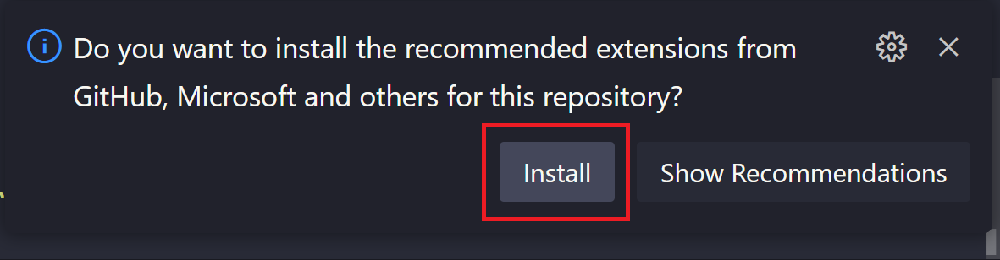

### [< Back to Challenge 0](../../Challenge-00.md)

## Why use Azure DevBox for this workshop?

If you are using a tenant/subscription provided by Microsoft for this workshop then we have created an Azure DevBox just incase you are running into issues on your own computer or your IT department block developer certs or localhost.

## What is Azure DevBox?

Azure DevBox is a cloud-based workstation that gives you a complete developer environment in the cloud. It’s already configured, so you can start coding quickly. However it will take about 25 minutes to deploy. 

## How to Create Your Dev Box

1. Go to [Azure DevBox](https://devbox.microsoft.com/).
1. Sign in using the credentials given when you registered.
1. Click to create your Dev Box, no additional configuration is needed.

## Logging In

1. Once your Dev Box is ready, sign in with your credentials.
1. You’ll see a Windows environment ready for coding.

## Clone the Repository and launch VS Code

1. Open a terminal (PowerShell or Command Prompt).
1. Run:

  ```bash
  git clone https://github.com/microsoft/ai-developer.git
  ```

1. Change into the cloned directory:

  ```bash
  cd ai-developer
  ```

1. In the same terminal, enter:

  ```bash
  code .
  ```

1. When prompted in VS Code to install recommended extensions, choose Yes to get everything you need for development.



> [!NOTE]
> If you don't see the popup, then just install the recommended extensions.
