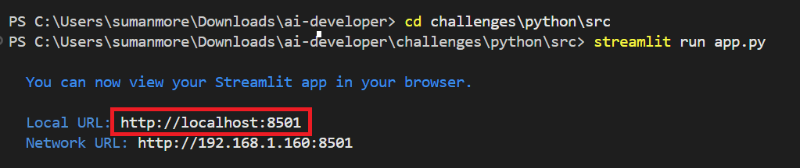
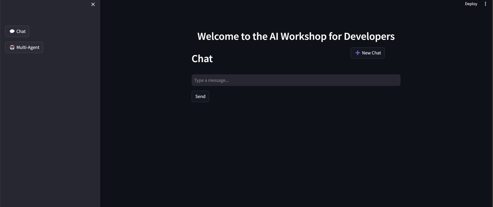

### [< Back to Challenge 2](../../Challenge-02.md)

# Getting Familiar With the Reference Application

This application was created as a sample application that allows you to focus on learning Semantic Kernel and Azure AI Foundry. It is a simple chat application that uses the Semantic Kernel framework to interact with an Azure AI Foundry chat model.The application is hosted using Streamlit, a beginner-friendly Python web framework. It features a simple chat window where users can interact with the AI model by typing a question or prompt and pressing the **Send** button or  **Enter** key. The AI model will then respond with an answer or completion to the prompt. You will need to complete the implementation of the chat API to send the user's prompt to the AI model and return the response to the user.

1. Navigate to the folder `Python/src` and open `app.py`(Streamlit application) file in Visual Studio Code. To run the application locally, execute the command in the terminal from the root of your repository.

    ```console
    cd Python\src
    streamlit run app.py
    ```

    You will see that the application starts running on the local host with port number "8501":

    ```console
    http://localhost:8501
    ```

    

    The application should start and display a chat window. In a similar manner to using the Azure AI Foundry in the previous challenge, you can interact with the chat window by typing a question or prompt and pressing the **Send** button or **Enter** key.

    

    **Note**: Currently, the application will respond with an error message because the AI Model has not been configured.

1. Note the only files you will be working with for the next few challenges(till Challenge 7) are seen in this screenshot. The `chat.py` file is where you will be making changes to complete the challenges.

1. Open the `chat.py` file

    At the heart of the Semantic Kernel framework is the **Kernel** object. Here is where you register the AI Models you will be working with and any Plugins you will be using in your application. You will learn about Plugins in later challenges.

    The Kernel object is being configured to use an Azure AI Foundry chat model by calling the ```AzureChatCompletion``` method of the Kernel class.  

    Locate the following code in the ```chat.py``` inside `initialize_kernel()` method:

    ```Python
    //Configure Semantic Kernel
    kernel = Kernel()
    ```

    Now that you know the basics of the reference application, you are ready to start the first challenge. If you have completed the other prerequisites and challenges, you are ready to move on to the next challenge. [BEGIN!](../../Challenge-02.md#challenges)

## Success Criteria

1. You found the kernel in the `chat.py` file inside `initialize_kernel()` method.
