# Lab 03: Evaluation Flow Setup

## Estimated Duration: 60 minutes

## Lab Overview
In this lab, you will set up an automated evaluation pipeline using built-in evaluation metrics and configure manual evaluation for deeper insights. You will begin by leveraging built-in metrics such as accuracy, precision, recall, and F1-score to assess model performance automatically. Then, you will set up a manual evaluation process where human reviewers can provide qualitative feedback on model outputs. This hands-on exercise will help you understand the integration of automated and manual evaluation methods to improve model accuracy and reliability.

## Lab Objectives
In this lab, you will perform the following:
- Task 1: Setup Manual Evaluation
- Task 2: Setup Automated Evaluation with Built-in Evaluation Metrics

## Task 1: Setup Manual Evaluation

In this task, you will set up a manual evaluation process to assess model performance. This involves defining evaluation criteria, collecting human feedback, and analyzing results to measure accuracy and identify potential biases. 

1. From the left navigation menu, under the **Access and Improve** section, select **Evaluation (1)**. On the **Assess and compare AI application performance** select **Manual evaluations (2)** tab. Select **+ New manual evaluation (3)**.

   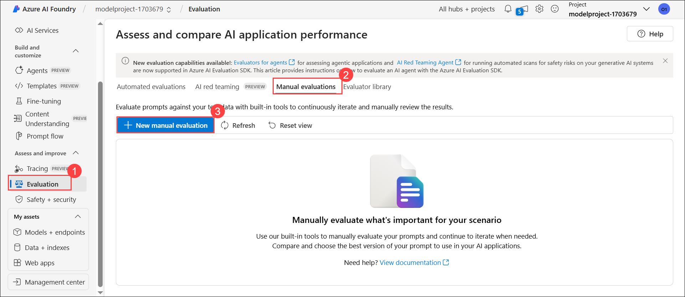

1. A new window opens with your previous **system message** already populated and your deployed model selected.

   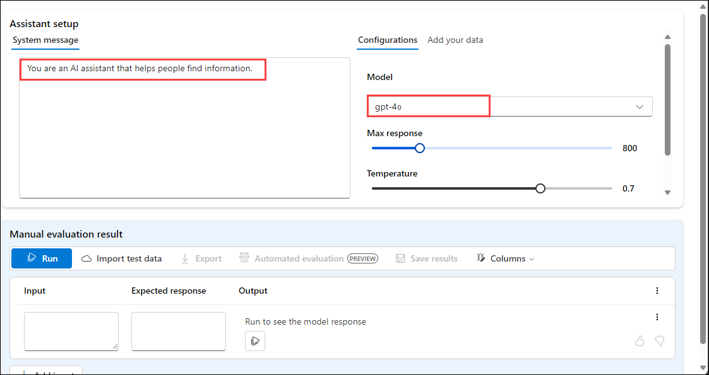

1. In the **Manual evaluation result** section, you'll add five inputs for which you will review the output. Enter the following five questions as five separate inputs by selecting **+ Add Inputs**:

   `Can you provide a list of the top-rated budget hotels in Rome?`

   `I'm looking for a vegan-friendly restaurant in New York City. Can you help?`

   `Can you suggest a 7-day itinerary for a family vacation in Orlando, Florida?`

   `Can you help me plan a surprise honeymoon trip to the Maldives?`

   `Are there any guided tours available for the Great Wall of China?`

1. Select **Run** from the top bar to generate outputs for all questions you added as inputs.

    

1. You can now manually review the **Outputs** for each question by selecting the thumbs up or down icon at the bottom right of a response. Rate each response, ensuring you include at least one thumbs up and one thumbs down response in your ratings.

   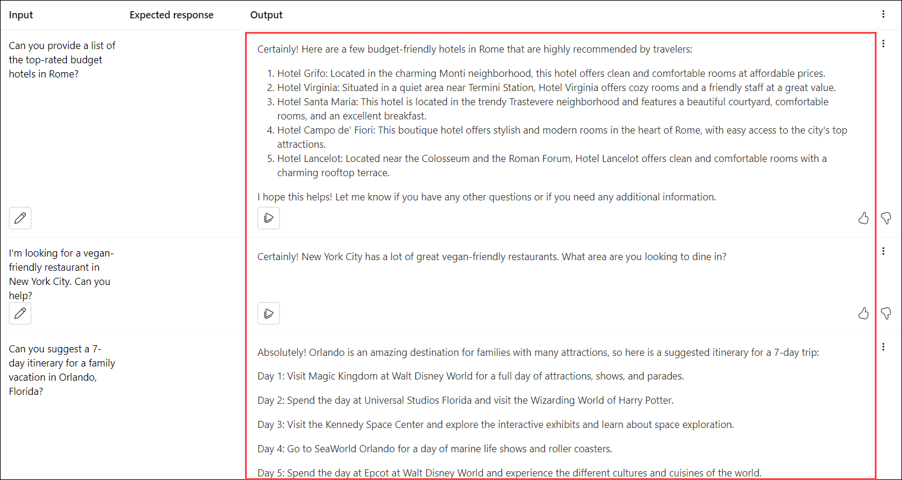

   > **Note:** If you receive an error in any of the output while executing the run "exceeded token rate limit of your current AIService", then please rerun the failed ones after couple of minutes.

1. Select **Save results (1)** from the top bar. Enter **manual_evaluation_results (2)** as the name for the results, and select **Save (3)**.

   
   
1. Using the menu on the left, navigate to **Evaluations (1)**. Select the **Manual evaluations (2)** tab to find the manual evaluations you just saved **(3)**. Note that you can explore your previously created manual evaluations, continue where you left of, and save the updated evaluations.

   

## Task 2: Setup Automated Evaluation with Built-in Evaluation Metrics

In this task, you will configure automated evaluation using built-in metrics to measure model performance quickly and accurately.

1. From the left navigation menu, under the **Access and Improve** section, select **Evaluation (1)**. On the **Assess and compare AI application performance** select **Automated evaluations (2)** tab. Select **Create a new evaluation (3)**.

   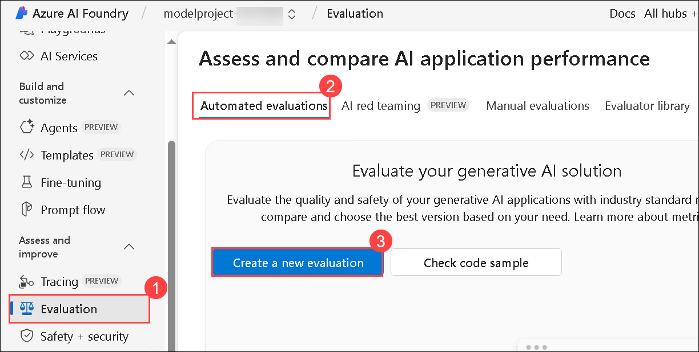

1. On the **What do you want to evaluate?** pane, select **Dataset**.

   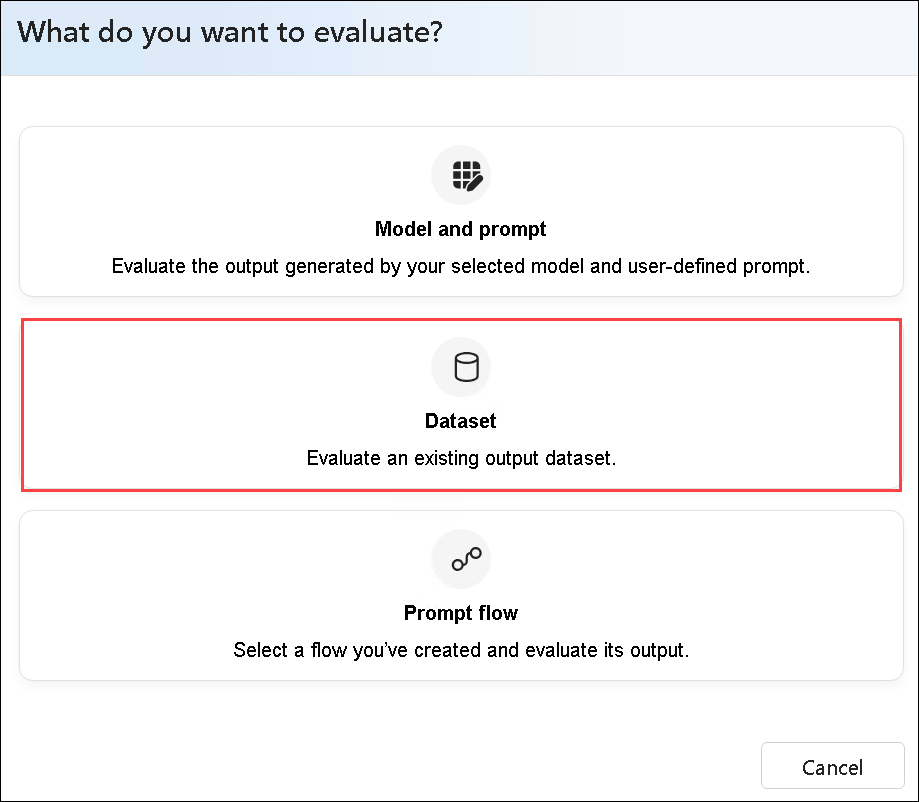

1. Create a new evaluation with the following settings:
    - **Evaluation name**: **Modelevaluation-<inject key="DeploymentID" enableCopy="false"/> (1)**
    - Select **Next (2)**.
       
       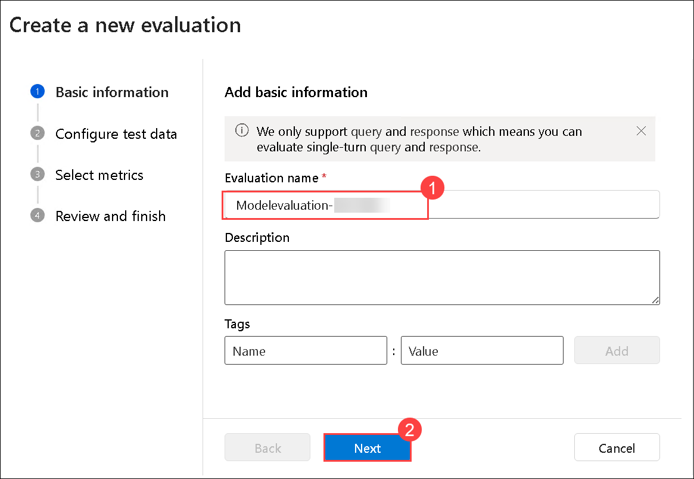

    - Open a new tab and paste the new link **https://raw.githubusercontent.com/MicrosoftLearning/mslearn-ai-studio/main/data/travel-qa.jsonl** JSONL file. press **Ctrl A** 
      and **Ctrl C** to select all and **Copy**.
  
    - Search for **Visual Studio (1)** in the Windows search bar of the vm and select **Visual Studio (2)**.

       

    - From the **File (1)** menu, select **New Text File (2)**, 

       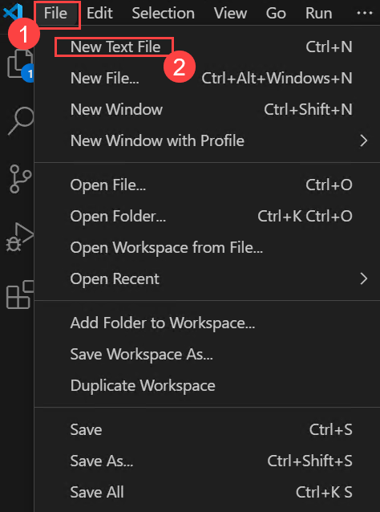

    - **Paste the copied code**.

    - Navigate to **File (1)** and click on **Save as (2)**.    

       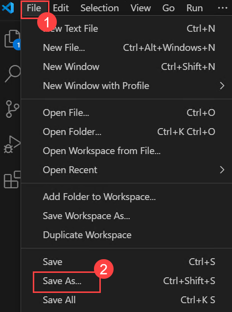    

    - Click on **Desktop (1)**, Enter the File name as **Sample (1)** select **JSON Lines (3)** for Save as type and then click on **Save (4)**.

               

1. Navigate back to **Azure AI foundary**, where your **creating a new evaluation**.
   
    - **Select the data you want to evaluate**: **Add your dataset (1)**, and select **Upload file (2)**.
  
         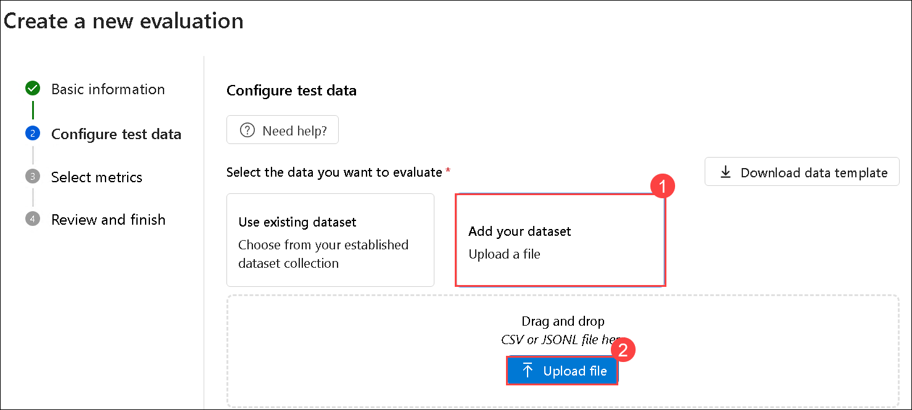

    - Navigate to **Desktop (1)**, select the file that you downloaded **(2)** and click on **Open(3)**

         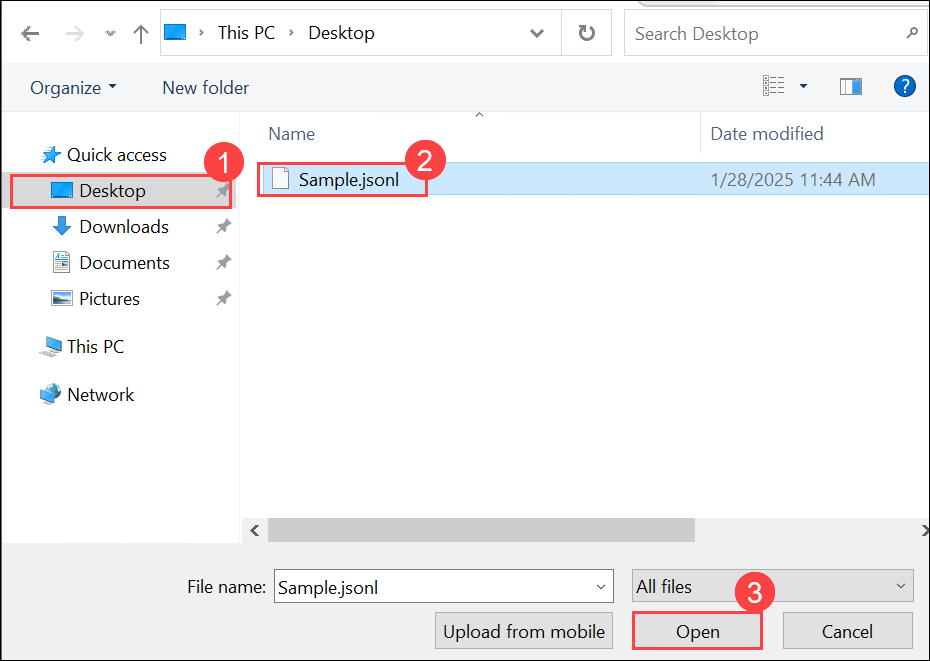   

    - Select **Next** 

    - **Select metrics**: **Coherence (1), Fluency (2)**
    - **Connection**: Your AI Services connection - **ai-modelhub<inject key="DeploymentID" enableCopy="false"/>xxxxxxxx_aoai (3)**
    - **Deployment name/Model**: **gpt-4o model (4)**

         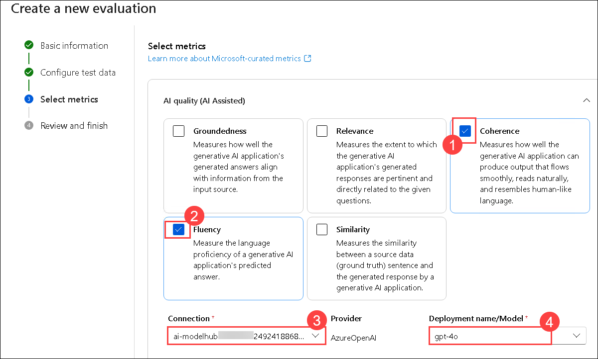  

    - Scroll down to **How does your dataset map to your evaluation input**. Ensure that **${data.query} (1)** is selected for the **query**, and **${data.response} (1)** is selected for the **response**.

    - Select **Next (2)**

         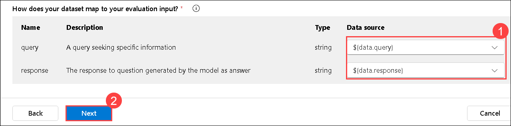  

    - Select **Submit**
   
1. Wait for the evaluations to be completed, you may need to refresh.

   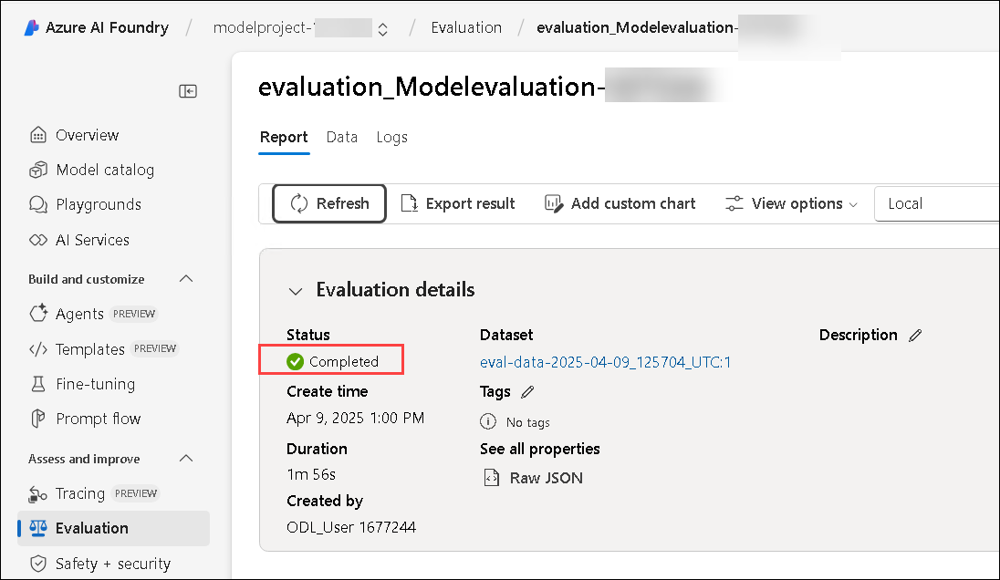

1. Select **Evaluation (1)** from the left navigation menu, and under **Automated Evaluation (2),** choose the newly created evaluation run **(3)**.

   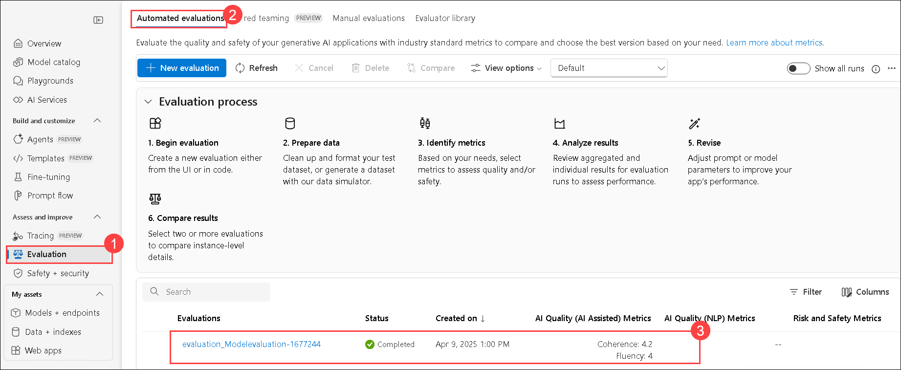

1. Under the **Report** tab, scroll down to explore the **Metric dashboard**.

    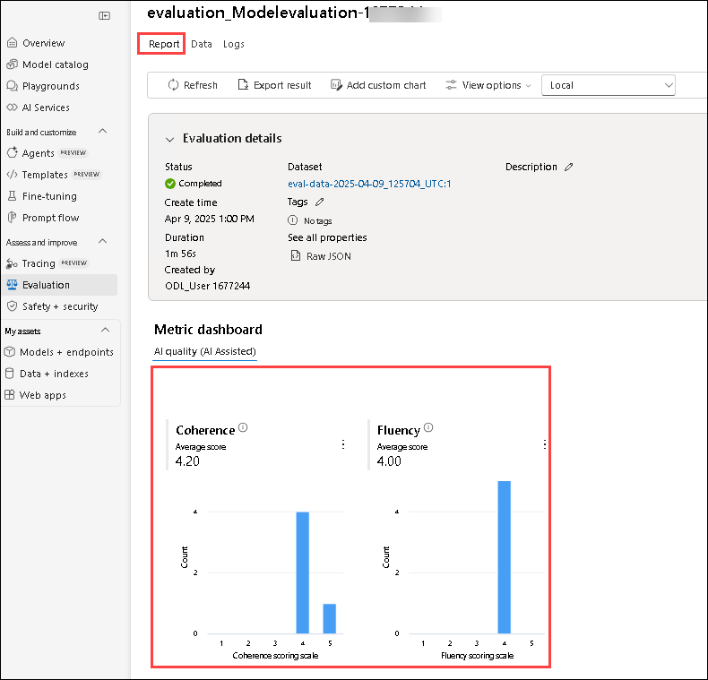

    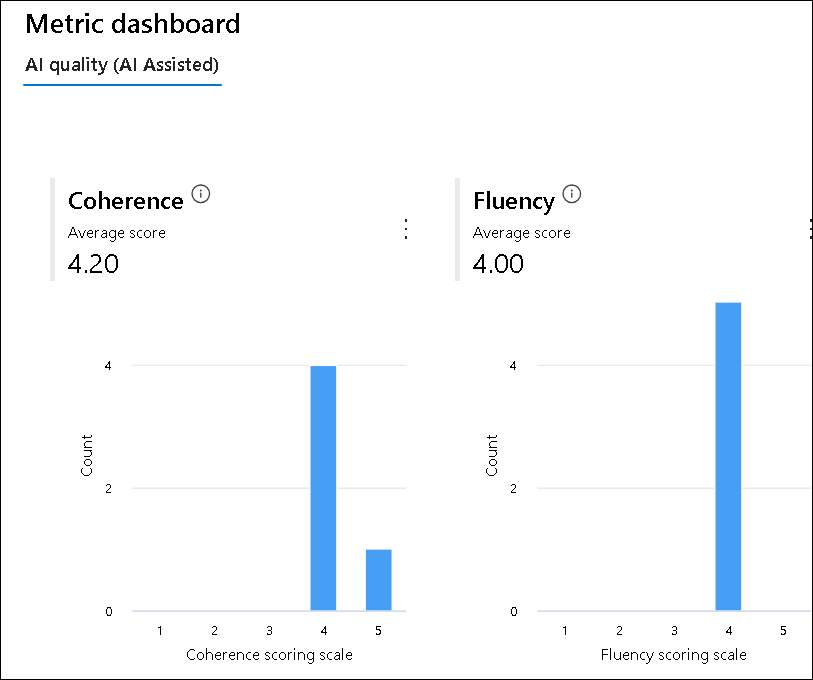

1. Navigate to **Data (1)** tab from the top menu to view the **Detailed metrics results (2)**.    

    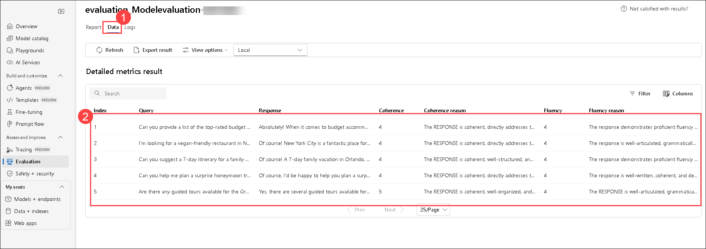

## Review
In this lab you have completed the following tasks:
- Set Up Manual Evaluation
- Setup Automated Evaluation with Built-in Evaluation Metrics

### You have successfully completed the lab. Click on **Next >>** to procced with next exercise.
