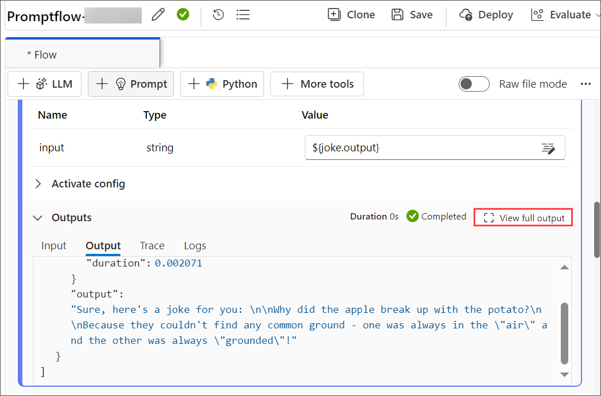

# Lab 01: Training the Model
### Estimated Duration: 30 minutes

## Lab scenario

In this lab, you will gain hands-on experience in initializing a Prompt Flow project in Azure AI Studio, setting up the necessary environment to begin developing, testing, and refining AI applications. You will create and customize prompts within Azure AI Studio's Prompt Flow. Starting with the creation of a new flow, you will add and configure the Prompt tool and develop a flow incorporating LLM (Large Language Model) and Prompt tools. By authoring a sample flow and running it with custom inputs, you'll learn how to monitor flow execution and evaluate outputs, thereby understanding the practical steps involved in developing, testing, and refining AI-driven workflows.
## Lab objectives
In this lab, you will perform the following:

- Task 1 : Initialize a Prompt Flow Project
- Task 2 : Create and Customize Prompts
- Task 3 : Develop a Flow with LLM and Prompt Tools


## Task 1: Initialize a Prompt Flow Project

As involves setting up a structured environment to manage and streamline prompt-based AI tasks. This process typically includes creating a project directory, configuring necessary files and dependencies, and establishing a workflow for prompt design, testing, and iteration. By organizing prompts, data, and evaluation metrics in a centralized system, the project ensures consistent and efficient development, making it easier to refine prompts and achieve desired outcomes.

1. Open a new tab, and navigate to the [Azure AI Studio](https://ai.azure.com/?reloadCount=1).

   >**Note:** Select **Sign in**, if you are not signed in.

1. On the **Azure AI Studio**, on the home page, select **+ New Project**.

   

1. On the **Create a project** page, and follow these instructions to fill out the properties:

   - Project name: **Modelproject-<inject key="DeploymentID" enableCopy="false"/>**
   - Hub: Create a new hub
   - Select **Next**.
   - Hub name: **modelhub<inject key="DeploymentID" enableCopy="false"/>**
   - Subscription: Set as default
   - Resource group: **ODL-MEMT-<inject key="DeploymentID" enableCopy="false"/>**
   - Location: **<inject key="Region" enableCopy="false"/>**
   - Connect Azure AI Services or Azure OpenAI: Keep it as default
   - Connect Azure AI Search: Keep it as default
   - Select **Next**

      
      
     
1. On the **Review and finish** page, select **Create a Project**.

1. You will be able to track progress in resource creation, and the project will be created when the process is complete. Once a project is created, you can access the playground, tools, and other assets in the left navigation panel.


### Task 2 : Create and Customize Prompts

Creating and customizing prompts involves designing specific, targeted questions or statements to elicit desired responses or actions. This process includes defining clear objectives, understanding the audience, and using precise language to ensure clarity and relevance. Customization can further refine prompts to align with particular contexts or user needs, enhancing engagement and effectiveness in various applications such as education, customer service, and AI interactions.

1. From the left navigation menu, under **Components**, select **Deployments (1)**.

1. On the **Define an endpoint to deploy your model**, under **Model deployments** tab, select **+ Deploy model (2)** and click on **Deploy a base model**.

   

1. On the **Select a model** page, search and select **gpt-4 (1)**, select **Confirm (3)** under the **gpt-4** and click on **Customize** to update the settings of deployment.

   

1. On **Deploy model gpt-4** follow these instructions to create the deployment:

   - Deployment name: **gpt-4 (1)**
   - Model version: Keep it as default (2)
   - Deployment type: **Standard (3)**
   - Connected Azure OpenAI resource: Select your OpenAI resource (4)
   - Tokens per Minute Rate Limit (thousands): **5K (5)**
   - Content filter: Set as default (6)
   - Enable dynamic quota: **Enabled (7)**
   - Select **Deploy (8)**

     
     
1. From the left navigation pane, select **Prompt flow (1)** > **+ Create (2)** to add the Prompt tool to your flow.

   

1. On **Create a new flow** blade, under **Standard flow**, click on **Create (1)**, then enter **Promptflow-<inject key="DeploymentID" enableCopy="false"/> (2)** for Folder name, then click on **Create (3)** 

   

   >**Note:** If you encounter any errors, wait for 5 minutes and recreate the prompt flow with a unique name. Once it is created, rename the flow on the newly created prompt flow page to **Promptflow-<inject key="DeploymentID" enableCopy="false"/>**.


### Task 3 : Develop a Flow with LLM and Prompt Tools

Developing a flow with Large Language Models (LLMs) and prompt tools involves designing a structured interaction where the LLM is guided by carefully crafted prompts to generate desired outputs. This process typically includes defining the objective, selecting appropriate LLMs, and iteratively refining prompts based on the model's responses to ensure accuracy and relevance. Prompt tools assist in managing and optimizing this interaction, enabling more efficient and effective use of LLMs in tasks such as content creation, data analysis, and automated customer support.

1. The prompt flow authoring page opens. You can start authoring your flow now. By default you see a sample flow. This example flow has nodes for the LLM and Python tools.

1. Optionally, you can add more tools to the flow. The visible tool options are **LLM, Prompt, and Python**. To view more tools, select **+ More tools**.

1. From the **Graph**, select **joke**. Choose an existing connection from the drop-down menu, and for deployment, select the newly created deployment, **gpt-4**, in the LLM tool editor. also do provide any **value** to Inputs flow to get the joke flow work. 

     

     

1. Scroll up for Input enter any fruit name as per your wish, select **Save**, and select **Start compute session**.

    

   >**Note:** It will take 1 - 3 minutes to start the session.
    
1. The flow run status is shown as Running, select **Run**.

     

1. Once the flow run is completed, select View outputs to view the flow results. The output will look similar to the image as shown below.

     

1. You can view the flow run status and output in the Outputs section.

    

1. From the top menu, select **+ Prompt** to add the Prompt tool to your flow, give the name of the flow as **modelflow**, and select **Add**.

    

1. Add this code inside the **modelflow** prompt tool, and select **Validate and parse input**

   ```jinja
   Welcome to {{ website_name }}!
   
    Hello, {{ user_name }}!
   
    Hello there!
   
   Please select an option from the menu below:
   1. View your account
   2. Update personal information
   3. Browse available products
   4. Contact customer support
   ```
1. In the input section add these following value, select **Save** and **Run**.

   - user_name: Jane
   - website_name: Microsoft

     

1. Once the flow run is completed, select View outputs to view the flow results. The output will look similar to the image as shown below.

     

1. You can view the flow run status and output in the Outputs section.

    
   
## Review
In this lab you have completed the following tasks:

- Initialize a Prompt Flow Project
- Created and Customized Prompts
- Developed a Flow with LLM and Prompt Tools

### Congratulations.! You have successfully completed the lab.
