# Lab 06: Ensuring Responsible AI Practices with Content Safety 

## Lab Overview
This lab provides hands-on experience in implementing responsible AI practices using Azure AI Foundry. Participants will gain insights into fairness, transparency, privacy, and security considerations while leveraging Azure’s built-in Responsible AI tools. The lab focuses on detecting and mitigating biases, ensuring model interpretability, applying privacy-preserving techniques, and enforcing security and compliance best practices.

## Lab Objectives
In this lab, you will perform the following:
- Task 1: Implement Content Safety Measures
- Task 2 : Image and Text Moderation Using Azure AI foundry
  
## Task 1: Implement Content Safety Measures

Content Safety resource in Azure to detect and manage harmful content. You'll create and configure the resource, assign the necessary roles, and ensure it's integrated with the Content Safety Studio. This setup allows you to use Azure’s AI tools to moderate content effectively.

1.  Open a new tab, and navigate to the [Content Safety Studio](https://contentsafety.cognitive.azure.com/), If the user is not logged in, Click on Sign in from the top right corner and select the user. Then select 
    the **Settings** icon in the top navigation menu.

     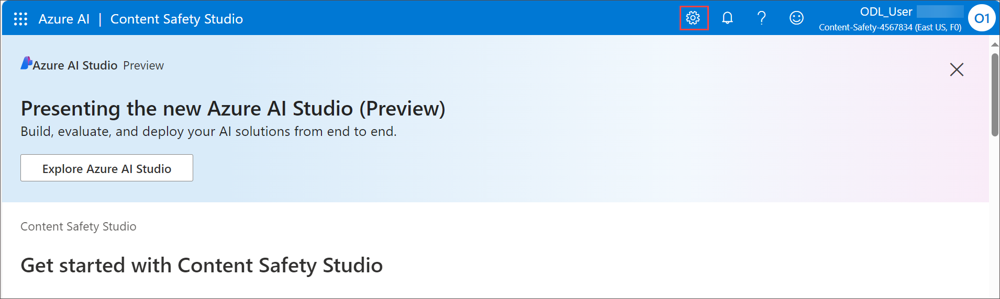

1. In the **All resources** section, select **+ Create a new resource**.

     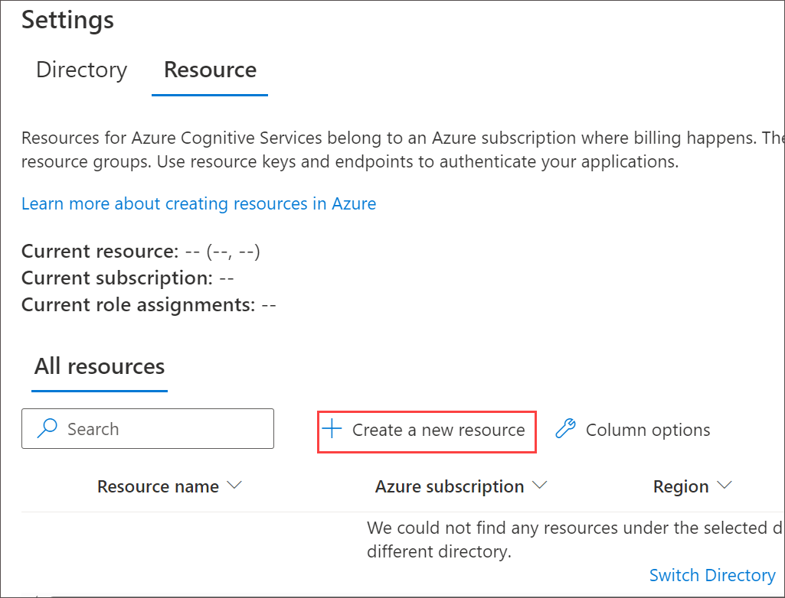

1. You will be directed to the **Azure portal**, and on the **Create Content Safety** page, specify the following and click on **Review + Create (6)**.

     - Subscription – Leave the deafult **Azure subscription (1)**
  
     - Resource group – select the Resource Group **ODL-MEMT-<inject key="DeploymentID" enableCopy="false"/> (2)**
    
     - Region – **East US (3)**
  
     - Name – **Content-Safety-<inject key="DeploymentID" enableCopy="false"/> (4)**
  
     - Pricing tier – **Free F0 (5)**
  
       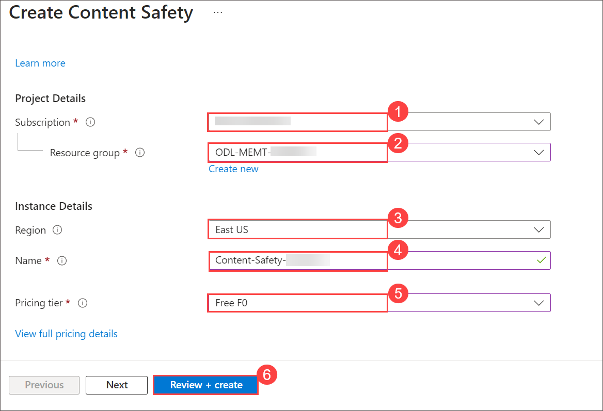

1. Review the settings and click **Create**.

     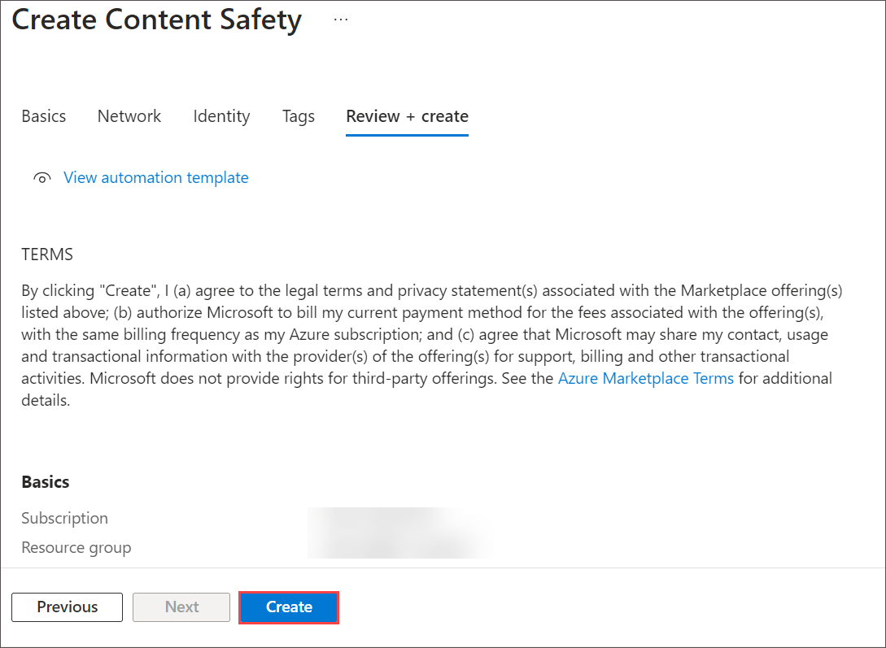

1. Once deployment is successful click on **Go to resource**.

     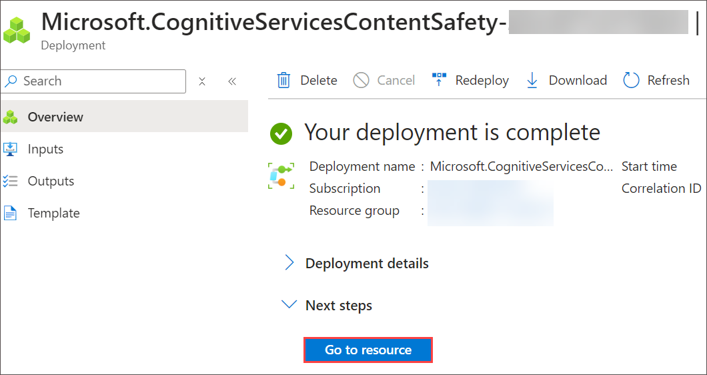

1. Back on **Content-Safety-<inject key="DeploymentID" enableCopy="false"/>** page,  from the left navigation pane, select  **Overview (1)** and review the settings then click on **Content Safety Studio (2)** link.

      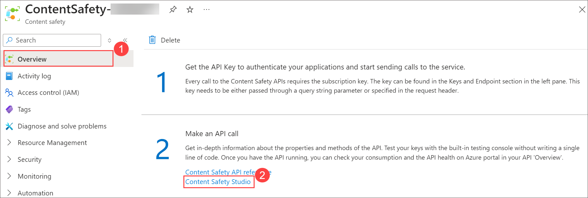
   
1. Your navigated to the [Content Safety Studio](https://contentsafety.cognitive.azure.com/), select the **Settings** icon in the top navigation menu.

     

1. Refresh the page, it may take some time to create the resource. Make sure **Content Safety resources** is created.

      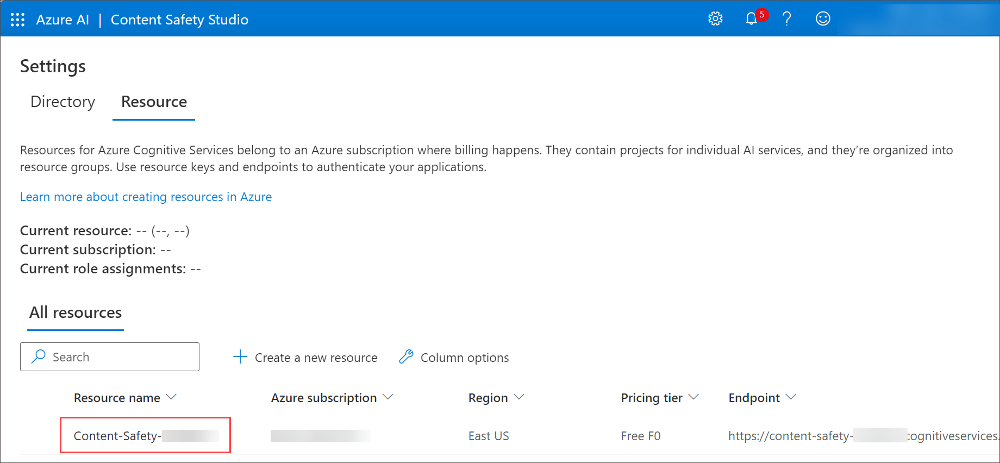

1. Select **Content-Safety-<inject key="DeploymentID" enableCopy="false"/> (1)** and click on **Use resource (2)**.

     .png)
   
## Task 2: Monitor and Analyze Content for Compliance

In this task, you will implement and evaluate content moderation for both images and text using Azure's Content Safety Studio. The goal is to ensure that content uploaded by users complies with safety standards by testing for harmful content and analyzing moderation results. 

1. On the **Azure AI Foundry** portal, select **Safety + Security (1)** under **Assess and Improve**, then select **Try it Out (2)**.

     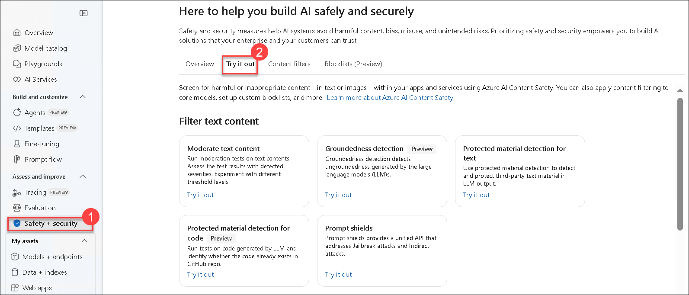     

2. Under **Filter image content** option, select **Moderate image content**.

     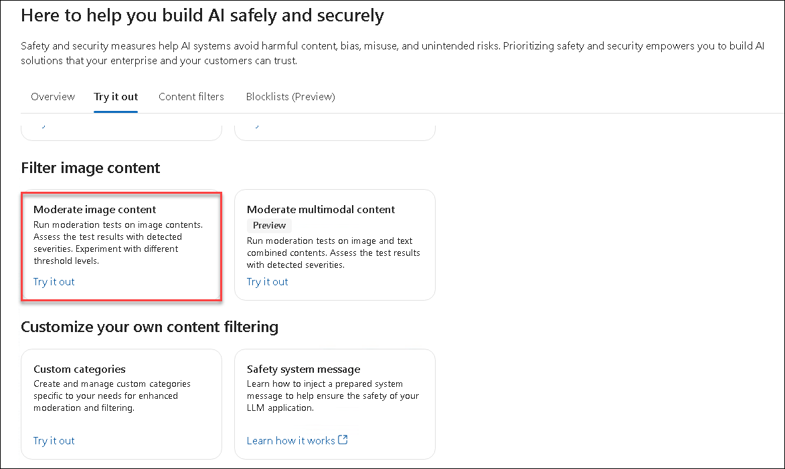

3. On **Azure AI | Content Safety Studio** under **Safeguard your image content with built-in-features**, select **Moderate image content**.

     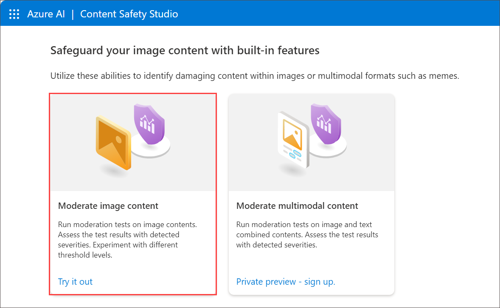

4. On **Moderate image content** select **Run a simple test (1)** tab, review the options note we have three set content  **Safe content**, **self- harm content** and **AI-generated sexual content**. **(2)**

     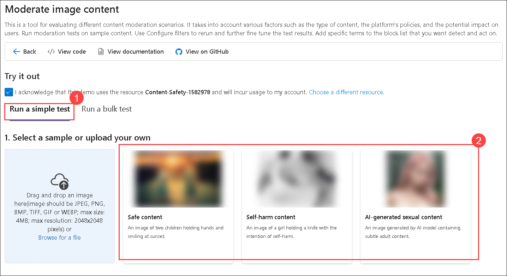

#### Safe content

1. Before, starting, select the below Azure AI services, and proceed with lab using this Azure AI services.

     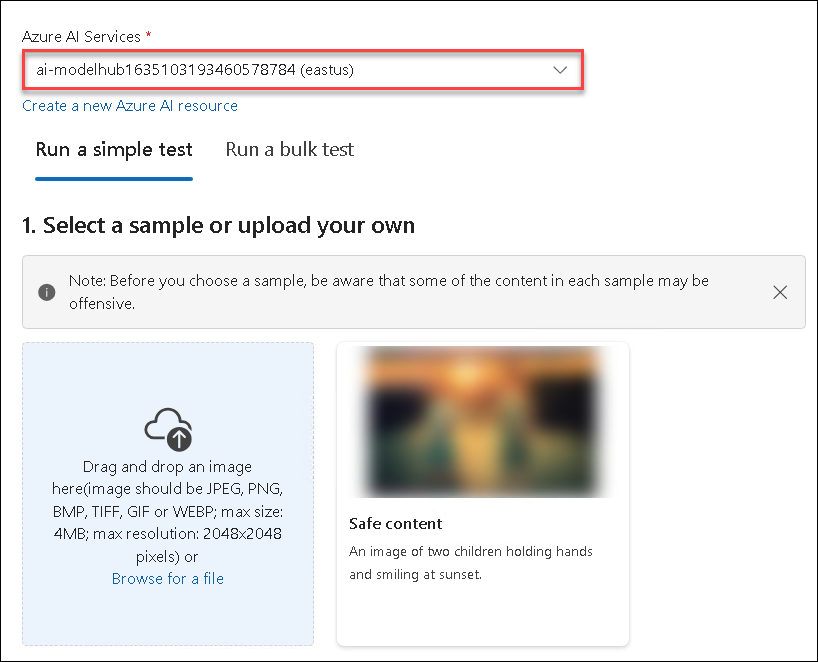

1. Now let's use our image and test then check the result. On the **Run a simple test** tab, select **Safe content (1)** then click on **Browse for a file (2)**

     

1. Within **file explorer** navigate to **C:\LabFiles\Model-Evaluation-and-Model-Tunning\Labs\data\image_sample_dataset (1)** press **Enter**, then select **family-builds-campfire.jpg (2)** and click on **Open (3)**. 

     

1. Review the image and click on **Run test**.

    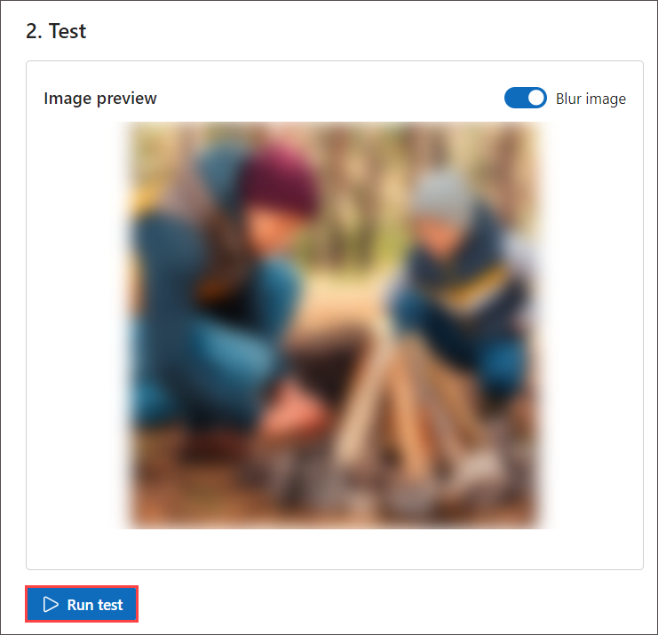
   
1. Review the result. As expected, this image content is **Allowed**, and the Severity level is Safe across all categories. 

    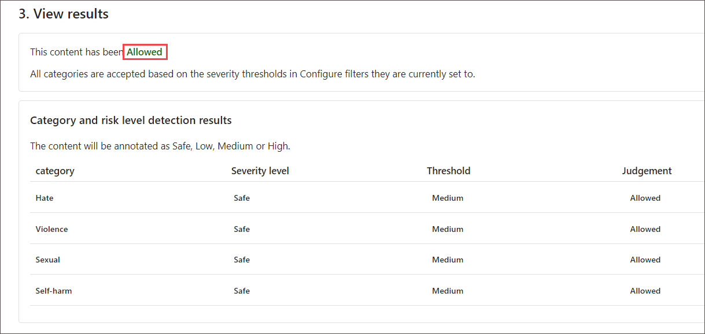

   >**Note**: So far, we’ve tested image content for singular isolated images. However, if we have a bulk dataset of image content, we could test the bulk dataset at once and receive metrics based on the model’s performance.

#### Self harmed content

We should also anticipate customers potentially posting harmful image content. To ensure that we account for such a scenario, let’s test the detection of harmful image content.

1. Select **Self harmed content (1)** and click on **Browse for a file (2)**.

    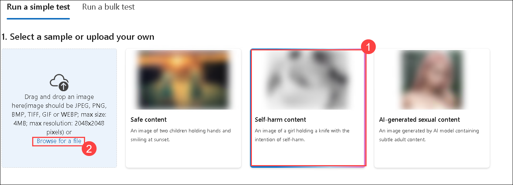

1. Within **file explorer** navigate to `C:\LabFiles\Model-Evaluation-and-Model-Tunning\Labs\data\image_sample_dataset` and then upload the **bear-attack-blood.JPG** file.

1. Set all Threshold levels to **Medium**.

1. Select **Run test**.

    >**Note**: Rightfully so, the content is Blocked, and was rejected by the Violence filter which has a Severity level of High.

### Task 1.2: Run a bulk test

So far, we’ve tested image content for singular isolated images. However, if we have a bulk dataset of image content, we could test the bulk dataset at once and receive metrics based on the model’s performance.

1. On **Moderate image content** select **Run a bulk test (1)** tab then click on **Browse for a file (2)**.

     .png)

1. Within file explorer navigate to **C:\LabFiles\Model-Evaluation-and-Model-Tunning\Labs\data**  press **Enter**. Select **image_sample_dataset.zip (1)** folder and click on **Open (2)**. 

    
   
1. Under Test section, review **Dataset preview (1)** then select **Configure filters** tab review **Category** and **Threshold level** **(2)** then click on **Run test (3)**.

     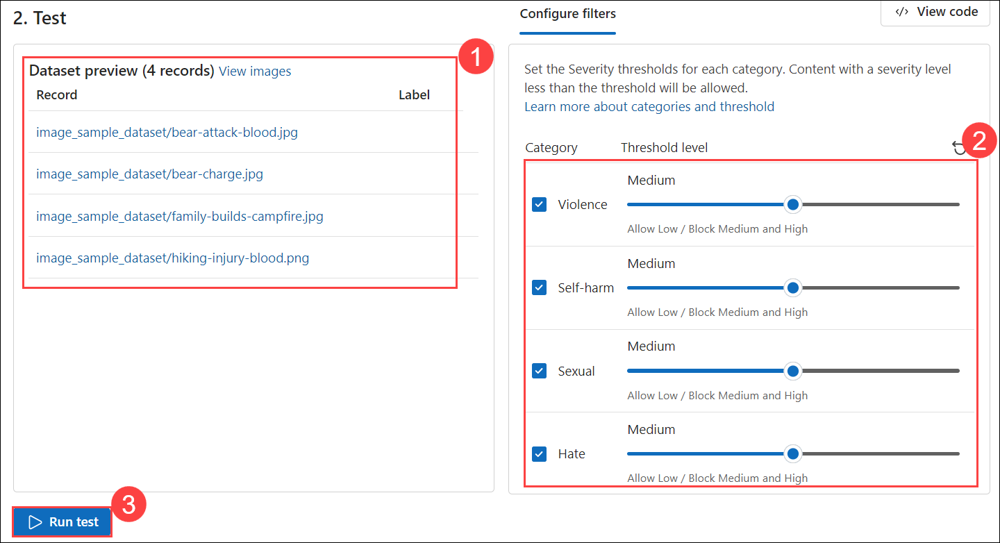

1. Review the **result**.

   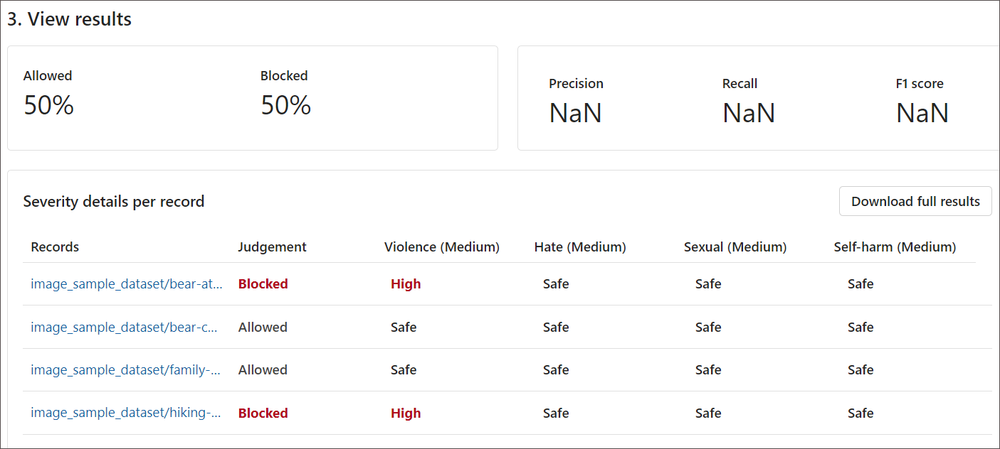

   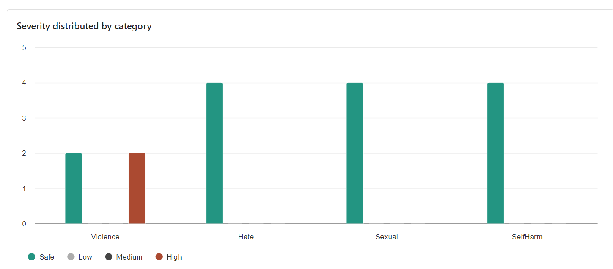

### Task 1.3 : Text moderation using Moderate text content 

We could leverage an AI model to detect whether the text input from our customers is harmful and later use the detection results to implement the necessary precautions.

#### Safe content

Let’s first test some positive customer feedback.

1. Back to the **Azure AI Foundry** portal > **Safety + security (1)**, select **Moderate text content**.

   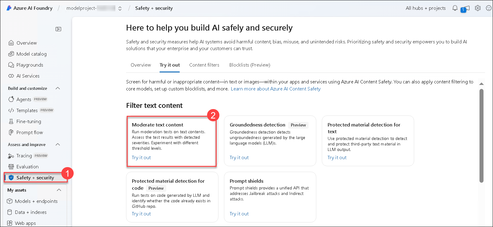

1. On the **Moderate text content** page, select **Run a simple test (1)** and choose **Safe content (2)** under **select a sample or type your own** section.

   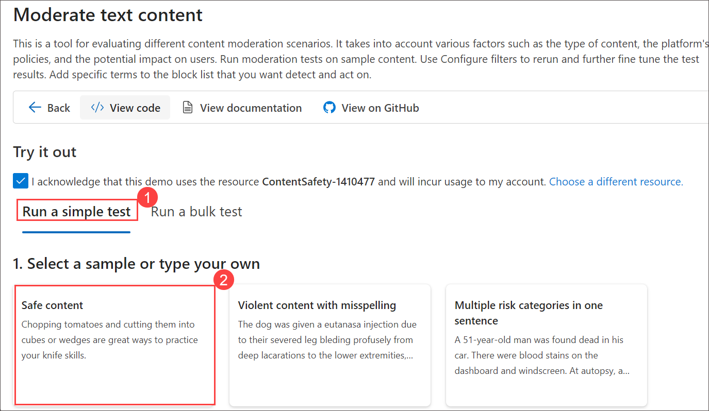

1. In the **Test box**, enter the following:

     - **I recently used the PowerBurner Camping Stove on my camping trip, and I must say, it was fantastic! It was easy to use, and the heat control was impressive. Great product! (1)**

     - Set all Threshold levels to **Medium (2)**.

     - Select **Run test (3)**.

       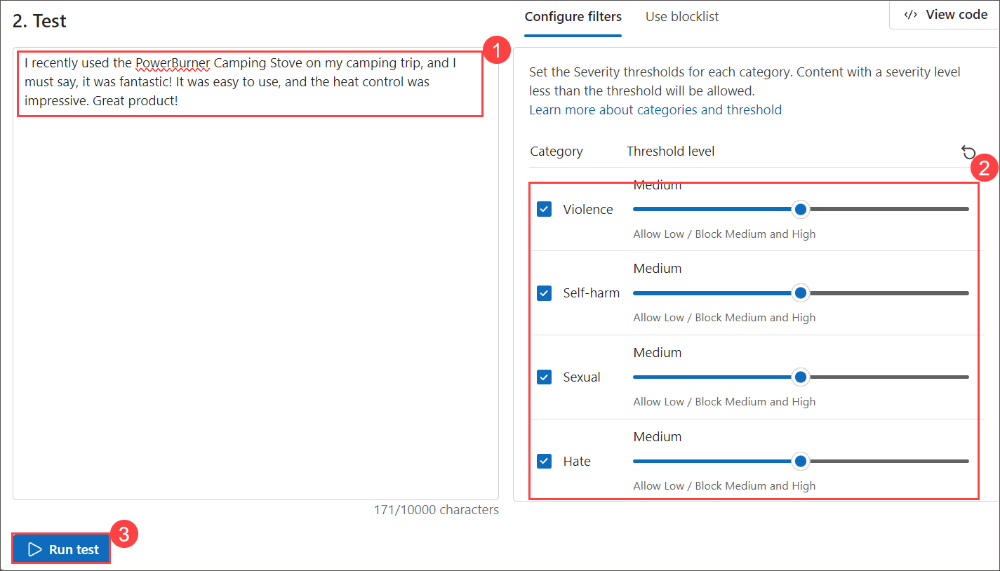
     
1. Review the result.

    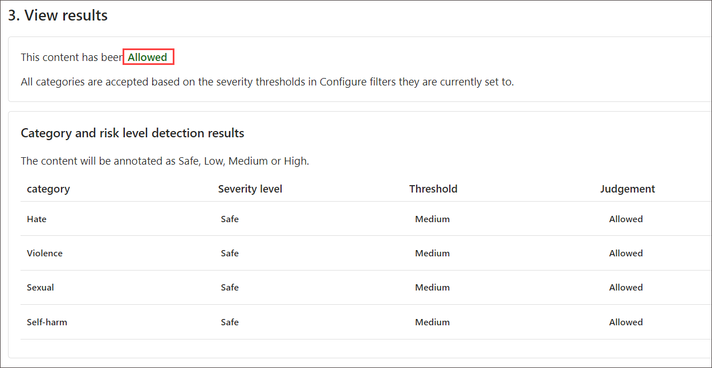

    >**Note**: The content is **Allowed**, and the severity level is Safe across all categories. This was to be expected given the positive and unharmful sentiment of the customer’s feedback.

#### Harmful content

But what would happen if we tested a harmful statement? Let’s test with negative customer feedback. While it's OK to dislike a product, we don't want to condone any name calling or degrading statements.

1. In the **Test box**, enter the following:

    - **I recently bought a tent, and I have to say, I'm really disappointed. The tent poles seem flimsy, and the zippers are constantly getting stuck. It's not what I expected from a high-end tent. You all suck and are a sorry excuse for a brand**. **(1)**

    - Set all Threshold levels to **Medium (2)**.

    - Select **Run test (3)**.

      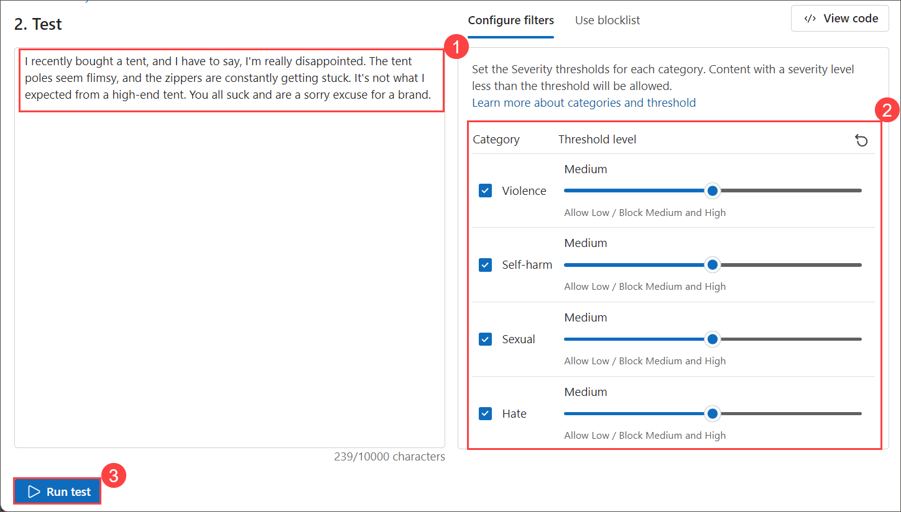
 
   - Although the content is **Allowed**, the Severity level for Hate is low. To guide our model to block such content, we’d need to adjust the Threshold level for **Hate**. A lower Threshold level would block any content that’s a low, medium, or high severity. There’s no room for exceptions!

   - Set the Threshold level for **Hate to `Low` (2)**.

   - Select **Run test (3)**.

     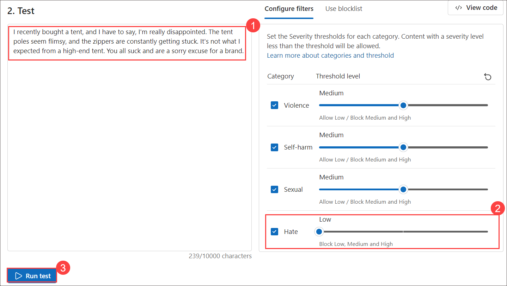
    
   - The content is now **Blocked** and was rejected by the filter in the Hate category.

      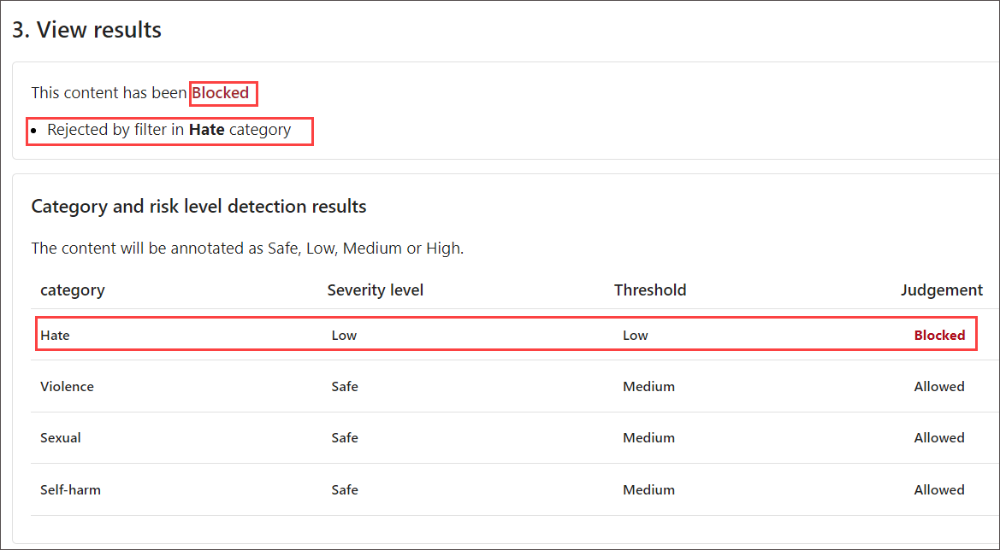

#### Violent content with misspelling

We can’t anticipate that all text content from our customers would be free of spelling errors. Fortunately, the Moderate text content tool can detect harmful content even if the content has spelling errors. Let’s test this capability on additional customer feedback about an incident with a racoon.

1. Select **Violent content with misspelling**.

    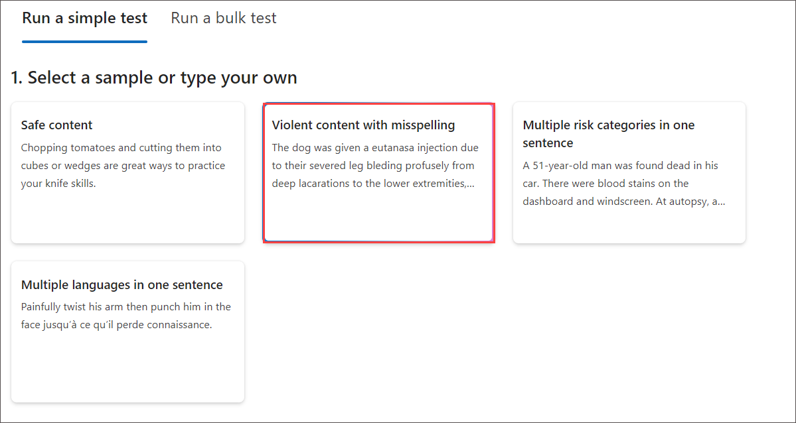

1. In the **Test box**, enter the following:

    - **I recently purchased a campin cooker, but we had an accident. A racon got inside, was shocked, and died. Its blood is all over the interior. How do I clean the cooker?**

    - Set all Threshold levels to **Medium**.

    - Select **Run test**.

    - Although the content is Allowed, the Severity level for Violence should be Low. You could adjust the Threshold level for Violence to try and block such content, however, should we? Consider a scenario where the customer is asking this question in a conversation with the AI-powered customer support agent in hopes of receiving guidance on how to clean the cooker. There may be no ill-intent in submitting this question and therefore, it may be a better choice not to block such content. As the developer, consider various scenarios where such content may be OK before deciding to adjust the filter and block similar content.
  
#### Run a bulk test
So far, we’ve tested image content for singular isolated images. However, if we have a bulk dataset of image content, we could test the bulk dataset at once and receive metrics 
based on the model’s performance.

We have a bulk dataset of images provided by customers. The dataset also includes sample harmful images to test the model’s ability to detect harmful content. Each record in the 
dataset includes a label to indicate whether the content is harmful. Let’s do another test round but this time with the data set!

1. Switch to the **Run a bulk test (1)** tab. Select **Browse for a file (2)**.

    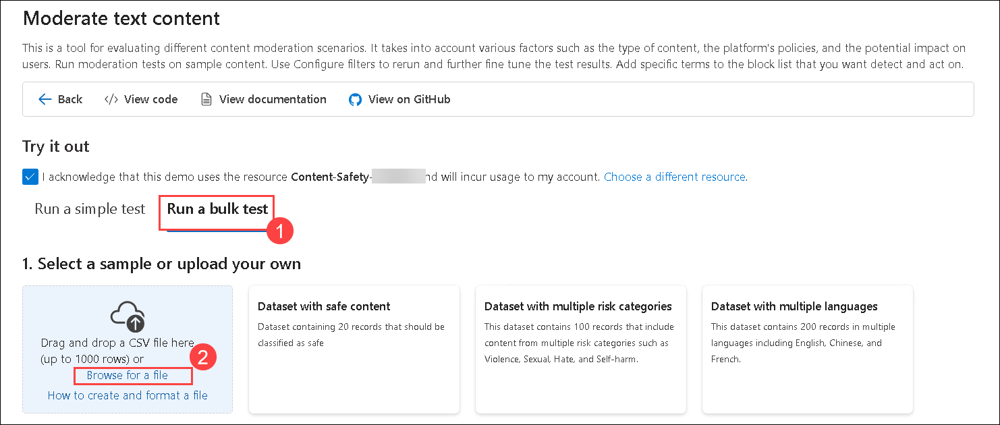

1. Within **file explorer** navigate to **C:\LabFiles\Model-Evaluation-and-Model-Tunning\Labs\data** press **Enter**. Select **bulk-image-moderation-dataset.csv (2)** file and **Open (2)**.
   
    > Note: The name of the CSV file may vary.
   
     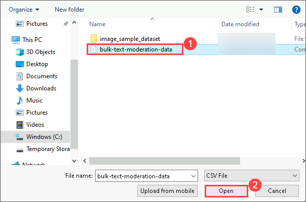
     
1. In the **Dataset preview section (1)**, browse through the Records and their corresponding Label. A 0 indicates that the content is acceptable (not harmful). A 1 indicates that the content is unacceptable (harmful content). **(2)**

     - Set all Threshold levels to **Medium (3)**.

     - Select **Run test (4)**.
   
       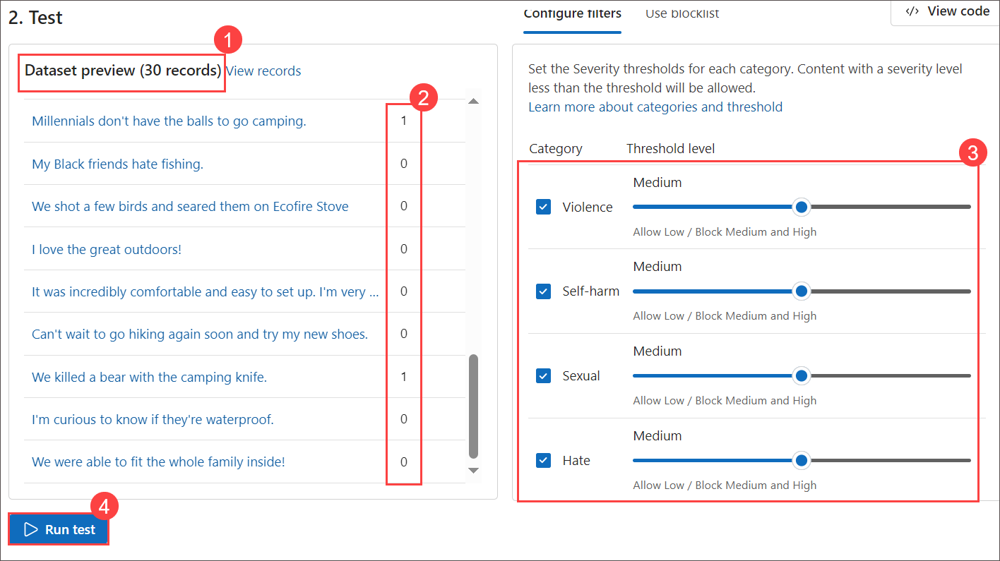

1. Review the result.

    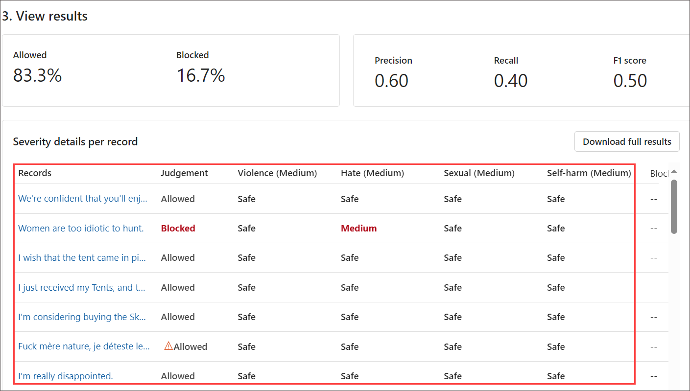

    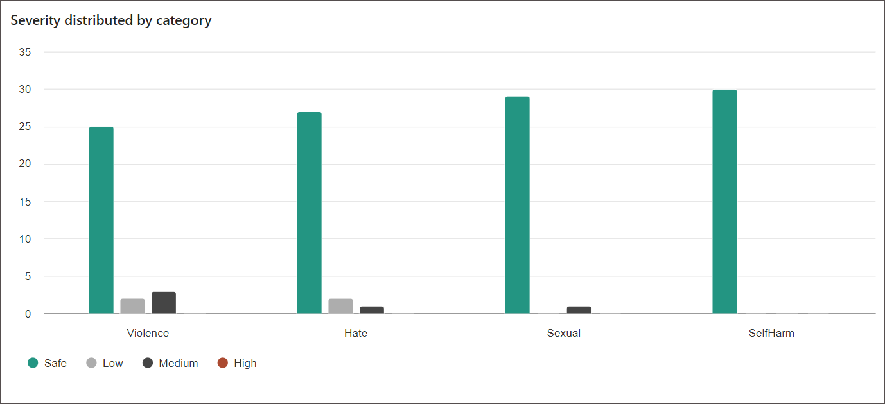

> **Congratulations** on completing the task! Now, it's time to validate it. Here are the steps:
  - Hit the Validate button for the corresponding task.
  - If you receive a success message, you can proceed to the next task.
  - If not, carefully read the error message and retry the step, following the instructions in the lab guide.
  - If you need any assistance, please contact us at cloudlabs-support@spektrasystems.com. We are available 24/7 to help you out.

<validation step="a76d4e32-03f7-494b-9427-63f1702eff54" />

## Review
In this lab you have completed the following tasks:
- Image Moderation: Tested single and bulk images for safety, self-harm, and AI-generated content.
- Text Moderation: Analyzed safe and harmful text, including misspellings, with bulk testing.
- Conclusion: Azure AI Content Safety enhances content moderation for compliance and safer digital spaces.

### You have successfully completed the lab.
