# Developing AI Applications with Azure AI Foundry

## Overall Estimated Duration: 8 Hours

## Overview

This lab is intended for AI developers, data scientists, AI Enthusiasts, Cloud Engineers, AI Engineers, aiming to enhance their skills in model evaluation and fine-tuning using Azure AI Foundry Prompt Flow. Participants will gain practical experience in developing custom AI models, evaluating their performance, and refining them for better results. The lab also addresses the integration of chat flows and essential tools, ensuring responsible AI practices through content safety measures.

## Objective 

This lab is designed to equip participants with hands-on experience in model evaluation and fine-tuning using Azure AI Foundry Prompt Flow. By completing this lab, participants will learn to:

- **Understanding the Lifecycle of Flow Development**: This lab provides a comprehensive understanding of AI application development using Azure AI Foundry's Prompt Flow. It covers the full development lifecycle, including initialization, experimentation, evaluation, refinement, and deployment. Participants will explore various flow types, such as Standard, Chat, and Evaluation, while learning how flows and nodes enable efficient data processing and task execution.

- **Building and Customizing Prompt Flows**: In this lab, you will gain practical experience in setting up and managing a Prompt Flow project within Azure AI Foundry. You will begin by initializing the project and configuring the development environment to support the creation, testing, and refinement of AI applications. The lab will guide you through designing and customizing prompts, starting with the creation of a new flow, integrating the Prompt tool, and incorporating Large Language Model (LLM) capabilities. By building and executing a sample flow with custom inputs, you will learn how to monitor execution, analyze outputs, and refine workflows, providing a comprehensive understanding of AI-driven application development.

- **Evaluation Flow Setup**: This lab focuses on setting up and analyzing evaluation flows for an AI model in Azure AI Foundry. You will systematically review model responses to diverse inputs, assessing performance based on key evaluation criteria. By defining and applying metrics like coherence and fluency, you will automate the evaluation process using a structured dataset. Through this hands-on experience, you will develop a deeper understanding of model assessment techniques and optimization strategies to improve AI performance.

- **Fine-Tuning Prompts for Optimal Performance**: This lab focuses on fine-tuning prompts to optimize AI model performance and enhance response quality. You will explore techniques for iterative prompt refinement, evaluate different prompt variations, and analyze their impact on model outputs. Additionally, you will work on optimizing flow performance to ensure efficiency and reliability in production environments. By the end of this lab, you will have a deeper understanding of how to systematically improve AI-generated responses and streamline workflow execution for real-world applications.

- **Implementing Chat Flow and Tool Integration**: Implementing and testing chat flows involves creating and evaluating the interactions between a user and a chatbot or automated messaging system. This process begins with designing the conversation paths, including potential user inputs and corresponding system responses, to ensure that the chatbot can effectively address various scenarios. After implementation, thorough testing is conducted to identify and rectify any issues, ensuring the chat flow is intuitive, accurate, and capable of handling diverse user interactions. The goal is to deliver a seamless and efficient user experience, refining the chat flow based on test results to improve functionality and user satisfaction.

- **Ensure Responsible AI Practices AI with Content Safety**:This lab offers hands-on experience in applying responsible AI principles using Azure AI Foundry. Participants will explore key aspects such as fairness, transparency, privacy, and security while utilizing Azure’s built-in Responsible AI tools. The session focuses on identifying and addressing biases, enhancing model interpretability, implementing privacy-preserving techniques, and ensuring security and compliance adherence.

## Prerequisites 

Participants should have:
Basic knowledge and understanding of the following

 - Azure Portal
 - Azure AI Foundry

## Architecture

- **Azure Portal** : The Azure Portal is a unified web-based console that provides a comprehensive interface for managing Azure resources. It allows users to build, manage, and monitor everything from simple web apps to complex cloud applications.
- **Azure AI Foundry** : Azure AI Foundry is a development environment for building, training, and deploying AI models. It provides tools and services to streamline the AI development lifecycle, including data preparation, model training, evaluation, and deployment.

## Architecture Diagram: 

  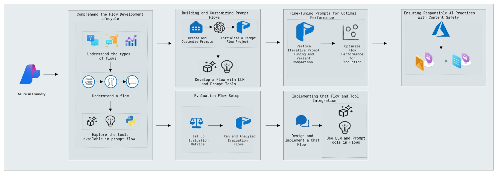

## Explanation of Components

The architecture for this lab involves the following key components:

- **Understanding the Lifecycle of Model Development**:
   - **Prompt Flow Stages**: Learn the stages of AI application development, including initialization, experimentation, evaluation, refinement, and production.
   - **Flow Types**: Understand different types of flows (Standard, Chat, Evaluation) within Azure AI Foundry.

- **Building and Customizing Prompt Flows**: Tailoring interactions enhances user engagement and satisfaction. Fine-tuning flows creates dynamic, responsive experiences that meet specific needs, leading to better outcomes and a personalized touch.
- **Evaluation Flow Setup**: Set up evaluation flows to automate model performance assessment using metrics like coherence and fluency.
- **Fine-Tuning Prompts for Optimal Performance**: Fine-tuning prompts involves adjusting components to enhance clarity and relevance. This optimization ensures interactions are more effective and engaging.
- **Implementing Chat Flow and Tool Integration**: Design, implement, and deploy chat flows, integrating inputs, LLM nodes, and output configurations using Azure AI Foundry.
- **Ensuring Responsible AI Practices with Content Safety**: Ensuring responsible AI practices involves implementing robust content safety measures to prevent harm and misuse. These components ensure AI interactions are ethical, secure, and aligned with user protection standards.

## Getting Started with the Lab

Welcome to your Developing AI Applications with Azure AI Foundry Workshop! We've prepared a seamless environment for you to explore and learn about the connection between creating, evaluating, and fine-tuning AI models using Prompt Flow. You'll develop custom AI models, automate evaluations, fine-tune performance, and integrate chat flows, all while ensuring responsible AI practices with Content Safety Studio. Let's begin by making the most of this experience:

## Accessing Your Lab Environment

1. Once you're ready to dive in, your virtual machine and **Guide** will be right at your fingertips within your web browser.

     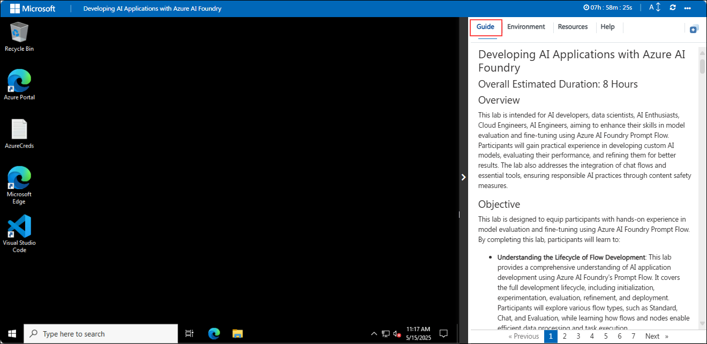

## Lab Guide Zoom In/Zoom Out

1. To adjust the zoom level for the environment page, click the **A↕ : 100%** icon located next to the timer in the lab environment.

   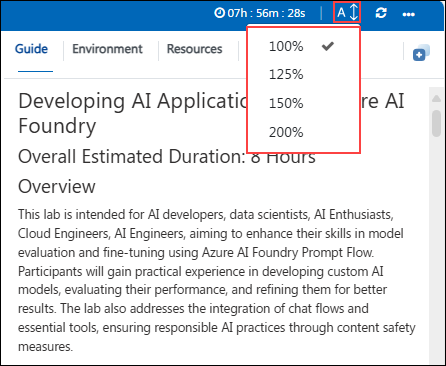  

## Virtual Machine & Lab Guide

Your virtual machine is your workhorse throughout the workshop. The lab guide is your roadmap to success.

## Exploring Your Lab Resources

1. To get a better understanding of your lab resources and credentials, navigate to the **Environment** tab.

   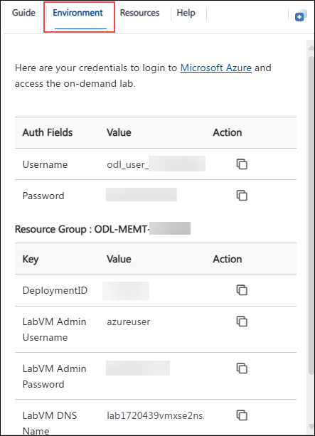

## Utilizing the Split Window Feature

1. For convenience, you can open the lab guide in a separate window by selecting the **Split Window** button from the Top right corner.

   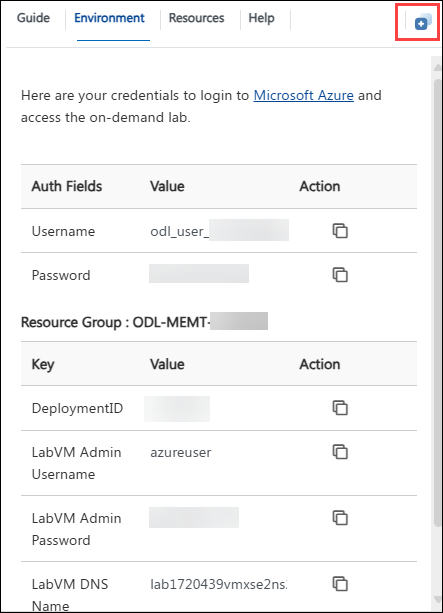

## Managing Your Virtual Machine

1. Feel free to **Start, Stop, or Restart (2)** your virtual machine as needed from the **Resources (1)** tab. Your experience is in your hands!

   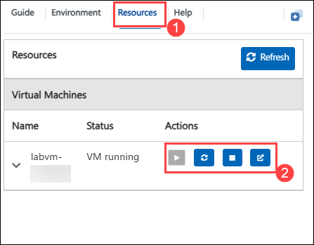

## Lab Validation

After completing the task, hit the **Validate** button under Validation tab integrated within your lab guide. If you receive a success message, you can proceed to the next task, if not, carefully read the error message and retry the step, following the instructions in the lab guide.

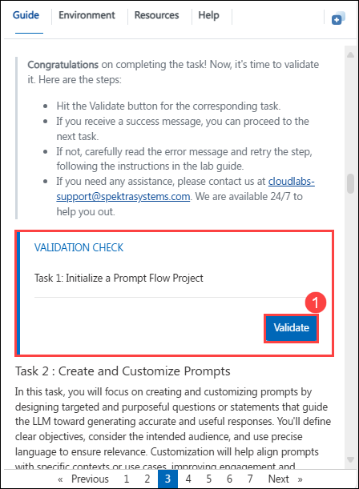

## Let's Get Started with Azure Portal

1. On your virtual machine, click on the Azure Portal icon as shown below:

   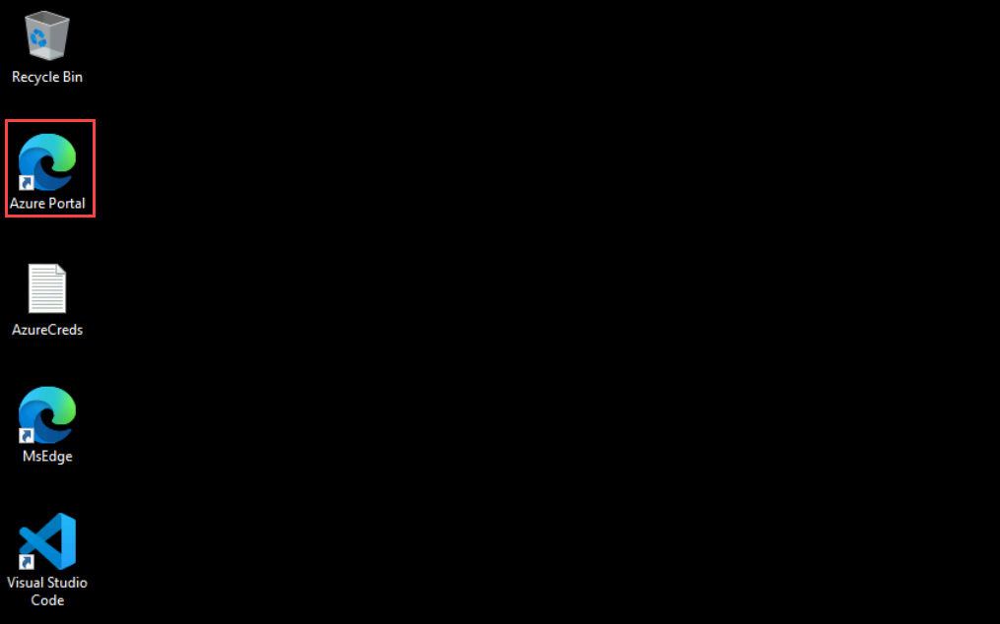

1. You'll see the **Sign into Microsoft Azure** tab. Here, enter your credentials:

   - **Email/Username:** <inject key="AzureAdUserEmail"></inject>

       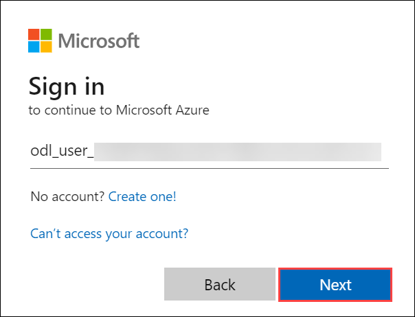

1. Next, provide your password:

   - **Password:** <inject key="AzureAdUserPassword"></inject>

       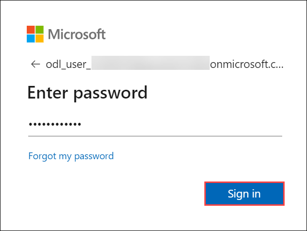

1. If **Action required** pop-up window appears, click on **Ask later**.

   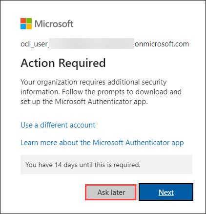

1. If prompted to stay signed in, you can click **Yes**.

1. If a **Welcome to Microsoft Azure** pop-up window appears, simply click **Cancel** to skip the tour.

## Steps to Proceed with MFA Setup if the "Ask Later" Option is Not Visible [Optional]

1. If you see the pop-up **Stay Signed in?**, click **No**.

1. If **Action required** pop-up window appears, click on **Next**.

   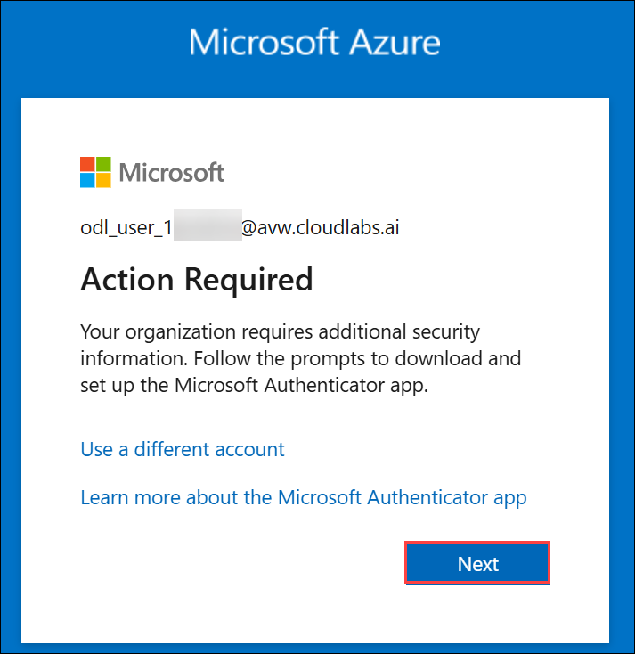

1. On **Start by getting the app** page, click on **Next**.

1. Click on **Next** twice.

1. In **android**, go to the play store and Search for **Microsoft Authenticator** and Tap on **Install**.

   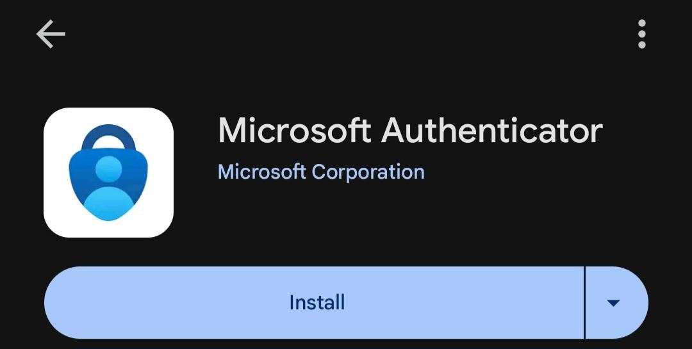

   > Note: For Ios, Open the app store and repeat the steps.

   > Note: Skip if already installed.

1. Open the app and tap on **Scan a QR code**.

1. Scan the QR code visible on the screen **(1)** and click on **Next (2)**.

   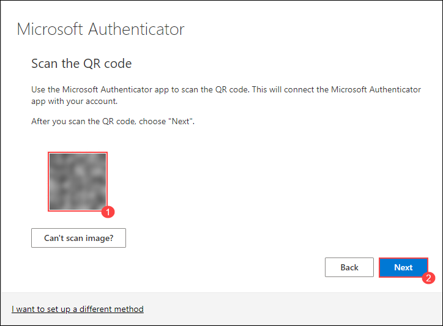

1. Enter the digit displayed on the Screen in the Authenticator app on mobile and tap on **Yes**.

1. Once the notification is approved, click on **Next**.

   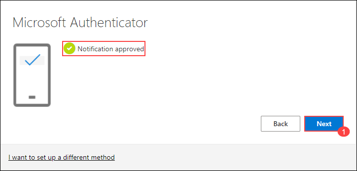

1. Click on **Done**.

1. If prompted to stay signed in, you can click **"No"**.

1. Tap on **Finish** in the Mobile Device.

   > NOTE: While logging in again, enter the digits displayed on the screen in the **Authenticator app** and click on Yes.

1. If a **Welcome to Microsoft Azure** pop-up window appears, simply click **"Cancel"** to skip the tour.

1. If you see the pop-up **You have free Azure Advisor recommendations!**, close the window to continue the lab.

## Support Contact

1. The CloudLabs support team is available 24/7, 365 days a year, via email and live chat to ensure seamless assistance at any time. We offer dedicated support channels tailored specifically for both learners and instructors, ensuring that all your needs are promptly and efficiently addressed.

   Learner Support Contacts:

    - Email Support: cloudlabs-support@spektrasystems.com
    - Live Chat Support: https://cloudlabs.ai/labs-support

2. Now, click on **Next** from the lower right corner to move on to the next page.

   

### Happy Learning!!
