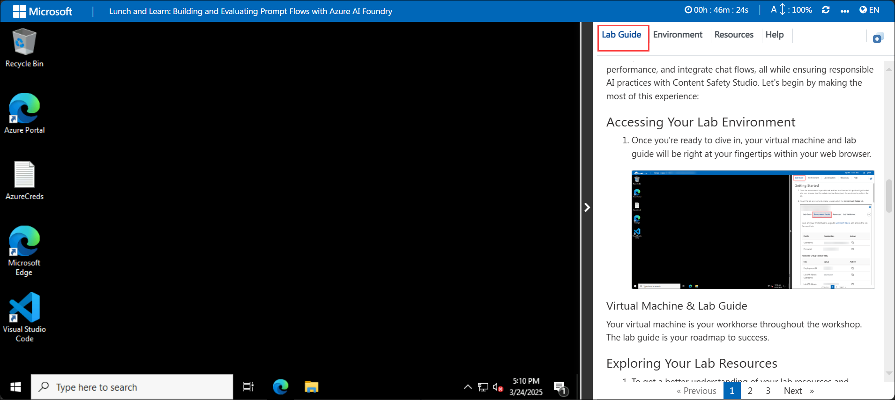
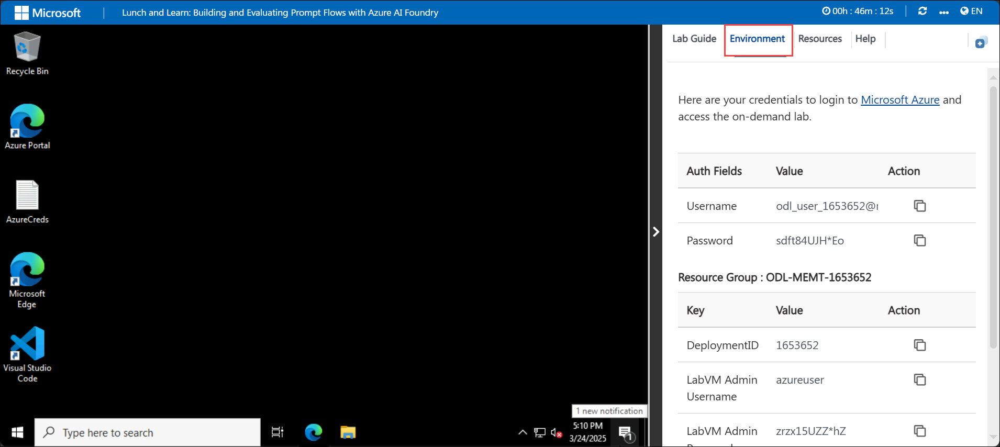
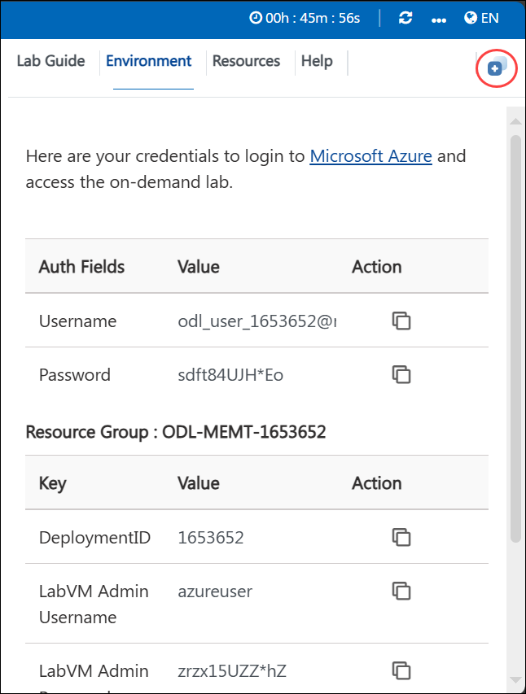
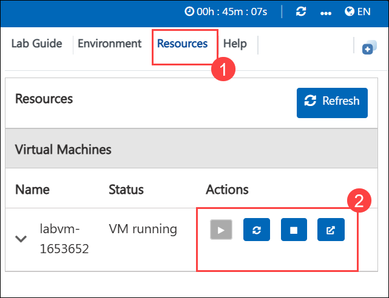
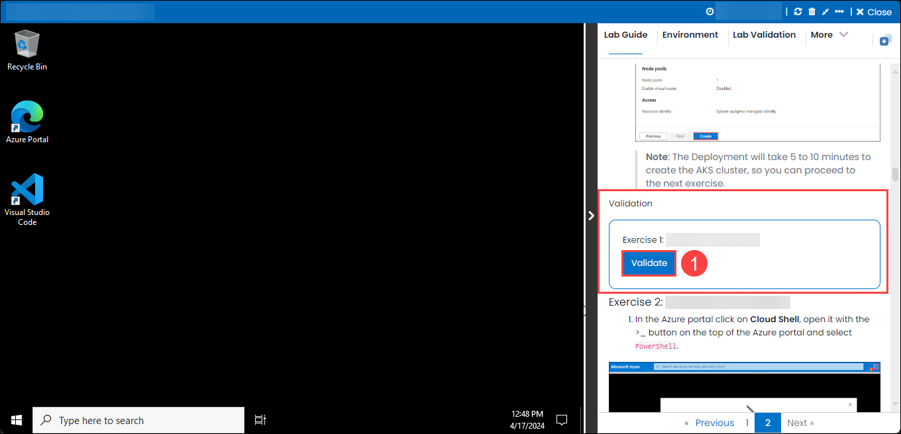

# Lunch and Learn: Building and Evaluating Prompt Flows with Azure AI Foundry

### Overall Estimated Duration: 60 minutes

## Overview 

In this lab, you will gain hands-on experience in developing custom AI models, training them effectively, and refining their performance for optimal results. You will also learn how to set up and automate model evaluations to ensure accuracy and reliability. Additionally, the lab covers integrating chat flows and essential tools, enabling seamless deployment and interaction with AI solutions.

## Objective 

This lab is designed to provide hands-on experience in model evaluation and fine-tuning using Azure AI Foundry Prompt Flow. By completing this lab, you will learn to:

- **Create and Train Models**: Creating and training models involves developing a machine learning or statistical model by first defining its structure and then training it using data. This process typically starts with selecting an appropriate algorithm based on the problem, such as regression, classification, or clustering. Once the model is chosen, it is initialized and trained on a dataset by feeding it input features and corresponding target values. During training, the model adjusts its parameters to minimize errors or maximize performance metrics. After training, the model is evaluated using separate validation data to assess its accuracy and generalizability. Fine-tuning and adjustments may be necessary to improve performance before deploying the model for real-world use.

- **Set Up and Automate Evaluations**: Setting up and automating evaluations involves creating a structured process to assess performance, skills, or outcomes efficiently. This typically includes defining evaluation criteria, designing assessment tools, and configuring automation software to streamline data collection and analysis. The goal is to ensure consistent and objective evaluations by reducing manual effort and minimizing human error. Automation can include scheduling regular evaluations, generating reports, and tracking progress over time, making the process more effective and scalable for organizations or educational institutions.

## Prerequisites 

Participants should have basic knowledge and understanding of the following
 
 - Azure Portal
 - Azure AI Foundry

## Explanation of Components 

- **Understanding the Lifecycle of Model Development**:
   - **Prompt Flow Stages**: Learn the stages of AI application development, including initialization, experimentation, evaluation, refinement, and production.
   - **Flow Types**: Understand different types of flows (Standard, Chat, Evaluation) within Azure AI Foundry.

- **Training the Model**: Create, configure, and run flows using Prompt and Large Language Model (LLM) tools in Azure AI Foundry.
- **Evaluation Flow Setup**: Set up evaluation flows to automate model performance assessment using metrics like coherence and fluency.

## Getting Started with the Lab
 
Welcome to your Building and Evaluating Prompt Flows with Azure AI Foundry Workshop! We've prepared a seamless environment for you to explore and learn about the connection between creating, evaluating, and fine-tuning AI models using Prompt Flow. You'll develop custom AI models, automate evaluations, fine-tune performance, and integrate chat flows, all while ensuring responsible AI practices with Content Safety Studio. Let's begin by making the most of this experience:
 
## Accessing Your Lab Environment
 
1. Once you're ready to dive in, your virtual machine and lab guide will be right at your fingertips within your web browser.

   

 ### Virtual Machine & Lab Guide
 
   Your virtual machine is your workhorse throughout the workshop. The lab guide is your roadmap to success.
 
## Exploring Your Lab Resources
 
1. To get a better understanding of your lab resources and credentials, navigate to the **Environment** tab.
 
   
 
## Utilizing the Split Window Feature
 
1. For convenience, you can open the lab guide in a separate window by selecting the **Split Window** button from the Top right corner.

   
 
## Managing Your Virtual Machine

1. Feel free to start, stop, or restart your virtual machine as needed from the **Resources** tab. Your experience is in your hands!

   

## Lab Guide Zoom In/Zoom Out

1. To adjust the zoom level for the environment page, click the **A↕ : 100%** icon located next to the timer in the lab environment.

   

## Lab Duration Extension

1. To extend the duration of the lab, kindly click the **Hourglass** icon in the top right corner of the lab environment. 

   

    >**Note:** You will get the **Hourglass** icon when 10 minutes are remaining in the lab.

2. Click **OK** to extend your lab duration.
 
    

3. If you have not extended the duration prior to when the lab is about to end, a pop-up will appear, giving you the option to extend. Click **OK** to proceed. 

## Lab Validation

After completing the task, hit the **Validate** button under Validation tab integrated within your lab guide. If you receive a success message, you can proceed to the next task, if not, carefully read the error message and retry the step, following the instructions in the lab guide.

## Support Contact

1. The CloudLabs support team is available 24/7, 365 days a year, via email and live chat to ensure seamless assistance at any time. We offer dedicated support channels tailored specifically for both learners and instructors, ensuring that all your needs are promptly and efficiently addressed.

   Learner Support Contacts:

    - Email Support: cloudlabs-support@spektrasystems.com
    - Live Chat Support: https://cloudlabs.ai/labs-support

2. Now, click on Next from the lower right corner to move on to the next page.

   

### Happy Learning!!