# Lab 02: Evaluation Flow Setup

### Estimated Duration: 30 Minutes

## Lab scenario
In this lab, you will set up and analyze evaluation flows for an AI model using Azure AI Foundry. You will manually review model responses to various inputs, providing a detailed evaluation of the model's performance. By setting up specific evaluation metrics, such as coherence and fluency, you will automate the evaluation process using a provided dataset. This hands-on experience will help you understand how to critically assess and refine AI model outputs, ensuring the model meets desired performance standards.

## Lab objectives
In this lab, you will perform the following:
- Task 1: Set Up Evaluation Metrics
- Task 2: Run and Analyze Evaluation Flows

## Task 1: Set Up Evaluation Metrics

You can manually review model responses based on test data. Manually reviewing allows you to test different inputs one at a time to evaluate whether the model performs as expected.

1. From the left navigation menu, under the **Access and Improve** section, select **Evaluation (1)**. On the **Assess and compare AI application performance** select **Manual evaluations (2)** tab. Select **+ New manual evaluation (3)**.

   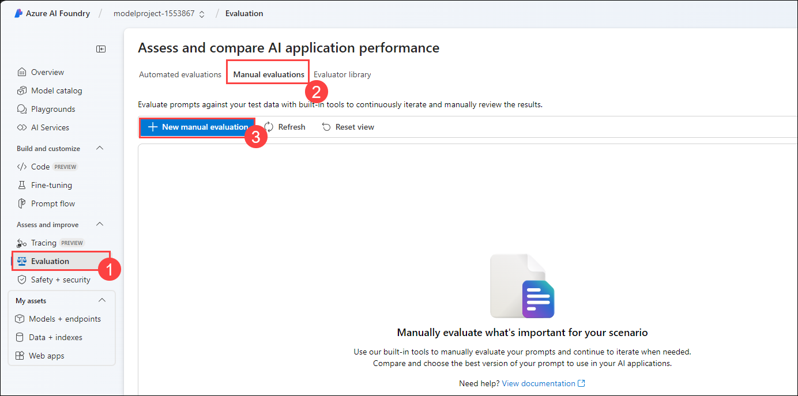

1. A new window opens with your previous system message already populated and your deployed model selected.

   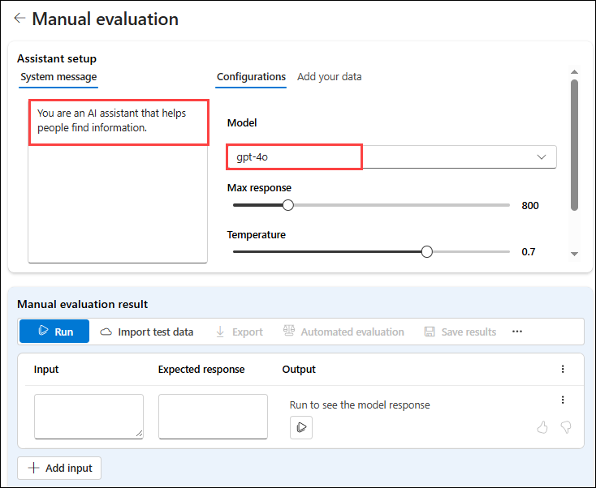

1. In the **Manual evaluation result** section, you'll add five inputs for which you will review the output. Enter the following five questions as five separate inputs by selecting **+ Add Inputs**:

   `Can you provide a list of the top-rated budget hotels in Rome?`

   `I'm looking for a vegan-friendly restaurant in New York City. Can you help?`

   `Can you suggest a 7-day itinerary for a family vacation in Orlando, Florida?`

   `Can you help me plan a surprise honeymoon trip to the Maldives?`

   `Are there any guided tours available for the Great Wall of China?`

1. Select **Run** from the top bar to generate outputs for all questions you added as inputs.

    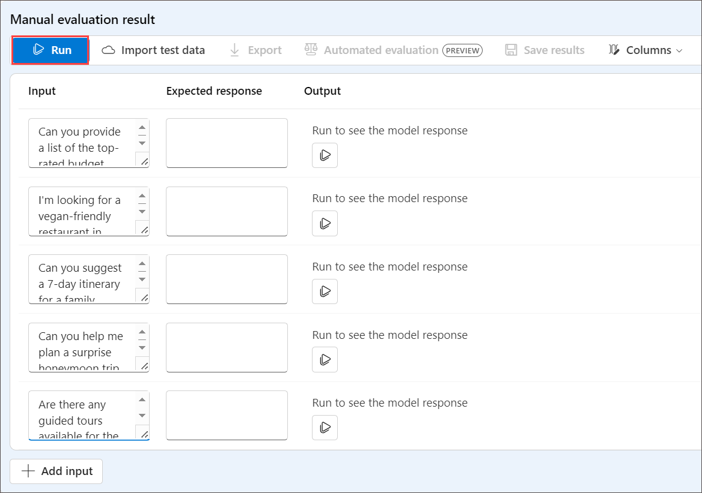

1. You can now manually review the outputs for each question by selecting the thumbs up or down icon at the bottom right of a response. Rate each response, ensuring you include at least one thumbs up and one thumbs down response in your ratings.

   .png)

1. Select **Save results** from the top bar. Enter **manual_evaluation_results** as the name for the results, and select **Save**.

   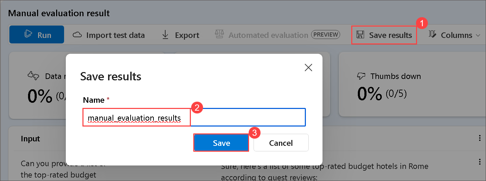
   
1. Using the menu on the left, navigate to **Evaluations**.

1. Select the **Manual evaluations** tab to find the manual evaluations you just saved. Note that you can explore your previously created manual evaluations, continue where you left of, and save the updated evaluations.

   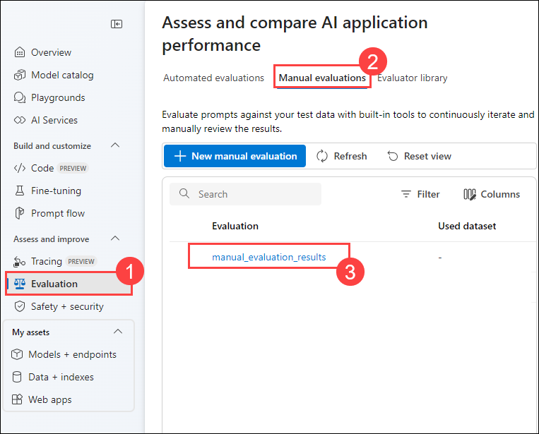

## Task 2: Run and Analyze Evaluation Flows

It systematically assesses the performance and effectiveness of various processes and systems. This involves executing evaluation workflows, collecting data, and thoroughly analyzing the results to identify strengths and weaknesses. By leveraging detailed insights from these analyses, organizations can make informed decisions, implement improvements, and optimize their operations. Continuous evaluation ensures that processes remain efficient, effective, and aligned with organizational goals, ultimately enhancing overall performance and productivity.

1. Select **Prompt flow** from left navigation pane and select the prompt flow you created.

   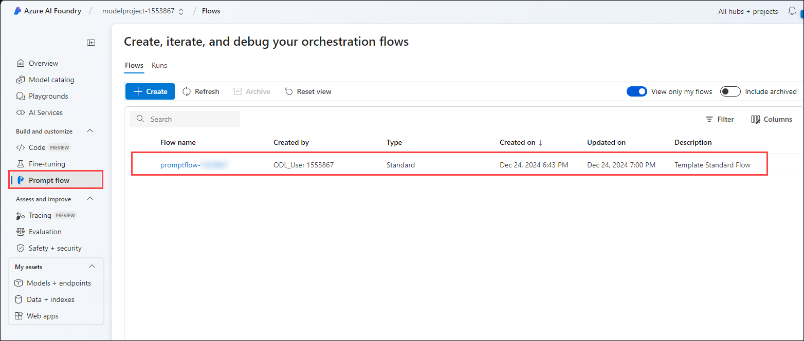

1. From the top menu bar select **Evaluate (1)** the from the drop down select **Automated Evaluation (2)**.

   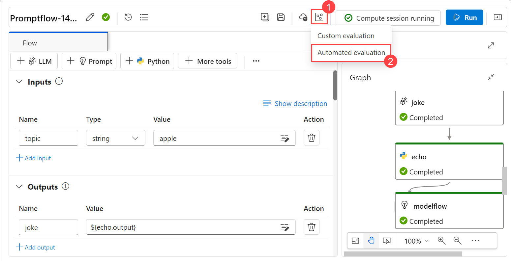

1. Create a new evaluation with the following settings:
    - **Evaluation name**: **Modelevaluation-<inject key="DeploymentID" enableCopy="false"/> (1)**
    - **What kind of scenario are you evaluating?**: **Question and answer with context (2)**, and click on **Next (3)**.
       > **Note:** If you don't see the option for selecting the **scenario**, please skip it.
       
       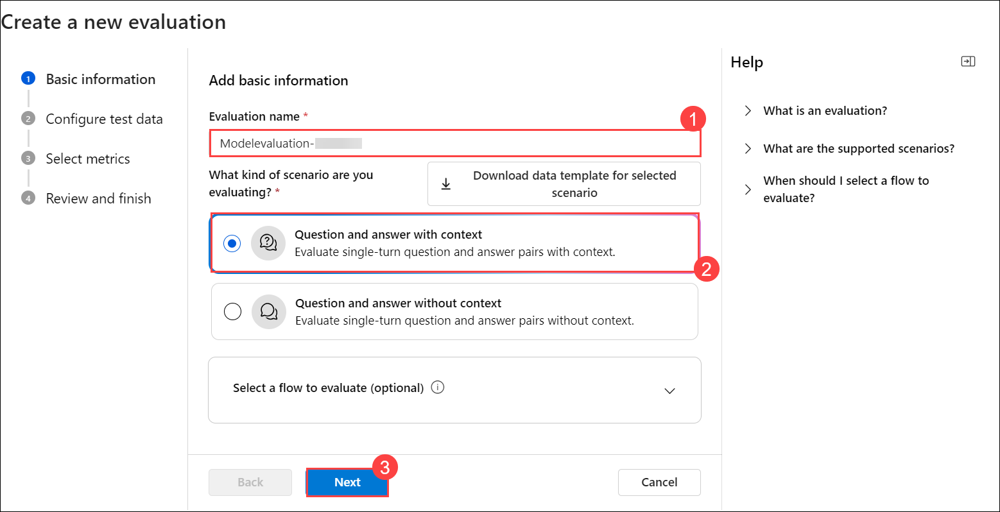

    - Open a new tab and paste the new link **https://raw.githubusercontent.com/MicrosoftLearning/mslearn-ai-studio/main/data/travel-qa.jsonl** JSONL file. press **Ctrl A** 
      and **Ctrl C** to select all and **Copy**.
  
    - Search for Visual Studio in the Windows search bar of the vm and open it.

       

    - From the **File (1)** menu, select **New Text File (2)**, paste the copied code.

       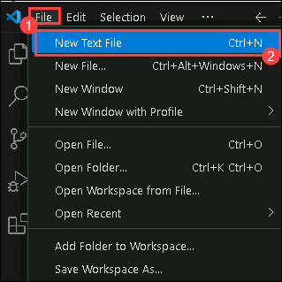

    - Provide the name as `sample and save it as **JSON Lines** file on your desktop.
  
       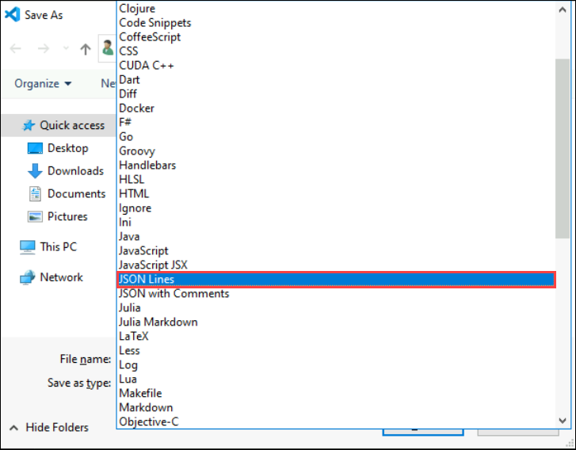

       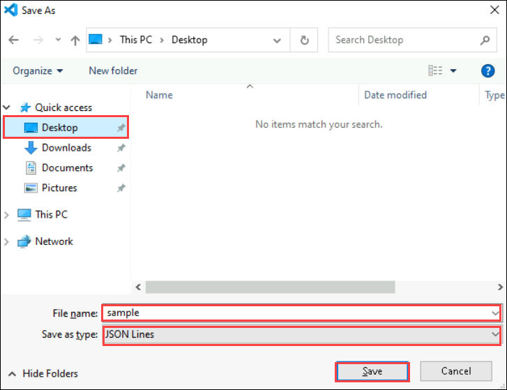
   
    - **Select the data you want to evaluate**: **Add your dataset (1)**, and select **Upload file (2)**, select the file that you downloaded.
  
         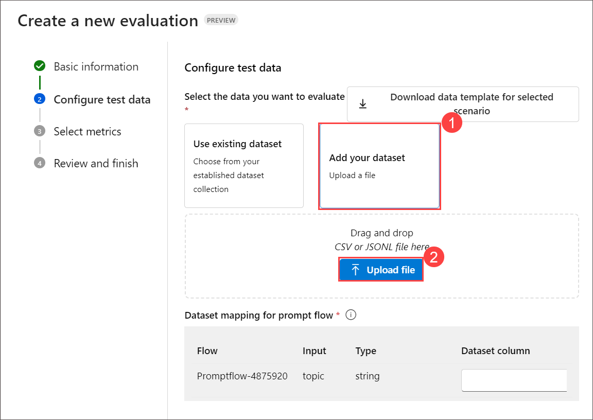

    - **Dataset mapping for prompt flow**: Select **${data.response}** for Dataset coloumn and click on **Next** 
    - **Select metrics**: **Coherence, Fluency**
    - **Connection**: Your AI Services connection - **ai-modelhub<inject key="DeploymentID" enableCopy="false"/>xxxxxxxx_aoai**
    - **Deployment name/Model**: **gpt-4o model**
    - Scroll down under **How does your dataset map to your evaluation input** for context select **${data.response}** from the drop-down.
    - Select **Next**
    - Select **Submit**

1. Wait for the evaluations to be completed, you may need to refresh.

1. Select the evaluation run you just created.

1. Explore the **Metric dashboard** and **Detailed metrics result**.

    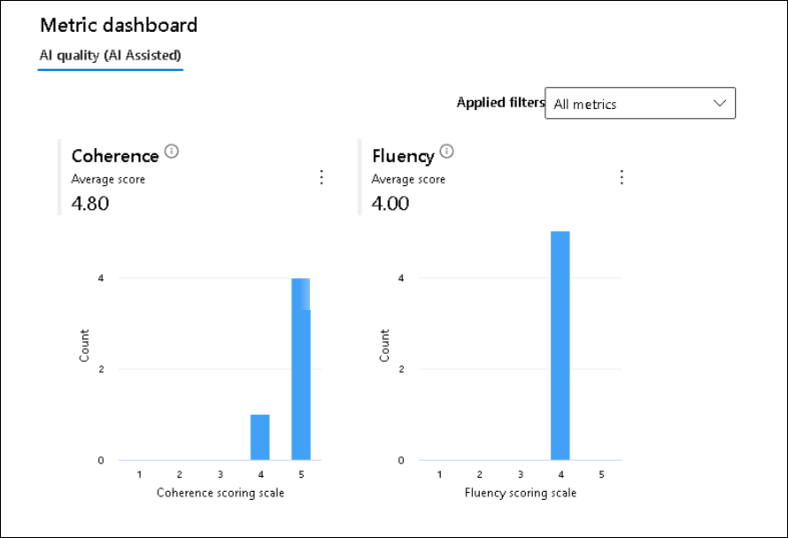
   >**Note:** The outcomes of Coherence and Fluency may vary with each iteration.

    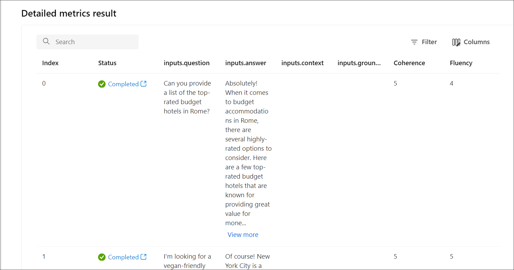

## Review

In this lab you have completed the following tasks:
- Set Up Evaluation Metrics
- Ran and Analyzed Evaluation Flows

### You have successfully completed the lab. Click on **Next >>** to procced with next exercise.
